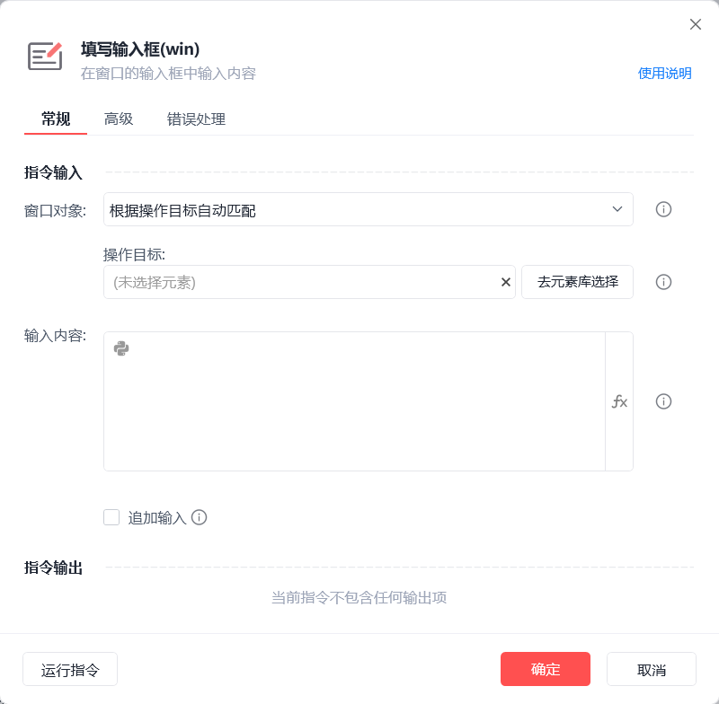
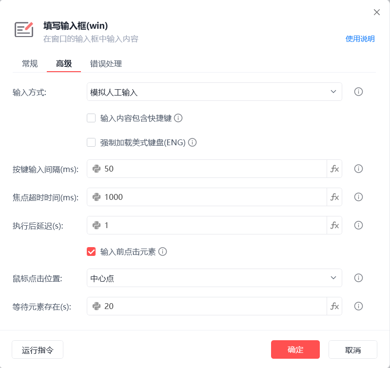
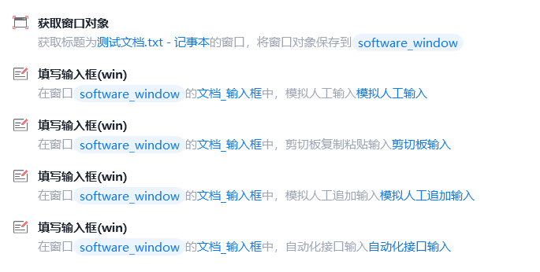
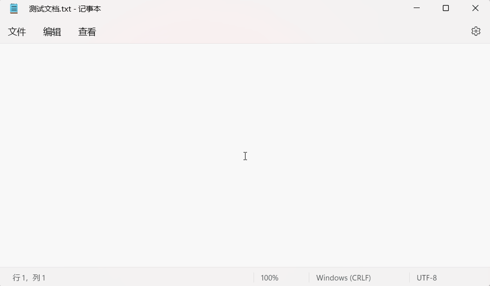

# 填写输入框(win)

填写输入框(win)
💡

在窗口的输入框中输入内容

🎬 视频课程：影刀RPA中级课程：桌面软件＋键鼠自动化

窗口对象

根据操作目标自动匹配或选择一个之前通过【获取窗口对象】指令创建的窗口对象

操作目标

从「元素库」中选择一个已捕获的元素或通过「捕获新元素」来捕获新的窗口元素作为操作目标

输入内容

填写待输入的文本内容

追加输入

若勾选则在"输入框"现有内容后继续追加输入，否则清空"输入框"后再进行输入

输入方式

模拟人工输入：通过模拟人工的方式触发输入事件(会自动切换当前的输入法为英文输入状态，以避免输入法造成的输入错误问题)

剪切板输入：将输入内容添加到剪切板通过Ctrl+V操作将内容填写到输入框

自动化接口输入：调用元素自身实现的自动化接口输入

输入内容包含快捷键

可在输入内容中加入快捷键，如：{enter}代表输入回车键

强制加载美式键盘(ENG)

存在不常见的输入法切换英文输入状态不成功的情况，需指定强制加载美式键盘(ENG)，确保模拟输入不受中文输入法影响

按键输入间隔(ms)

两次按键输入的间隔时间，若输入内容出错可适当延长

焦点超时时间(ms)

设置获取输入框焦点的超时时间

执行后延迟(s)

指令执行完成后的等待时间

输入前点击元素

在执行输入动作前先点击元素，以便获取焦点

鼠标点击位置

中心点：元素矩形区域的中心点

随机位置：自动随机元素矩形区域内的点

自定义：手动指定目标点

等待元素存在(s)

等待目标元素存在的超时时间

使用示例

此流程执行逻辑：执行【获取窗口对象】指令获取记事本窗口 --> 捕获指定输入框元素 --> 使用【填写输入框(win)】指令 --> 依次执行"模拟人工输入"、"剪切板输入"、"模拟人工追加输入"、"自动化接口输入"

常见问题

快捷键符号对照表

## 参数截图

