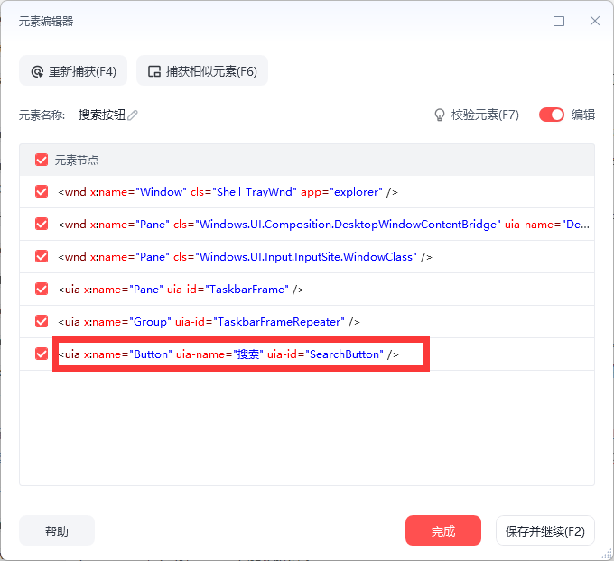

# 常用元素属性

常用元素属性

具体元素归类请查看元素编辑部分，如下所示，元素最后一个节点标注uia，则该元素为UIA元素，其他元素类似。

以下为常用元素的属性，包括UIA元素，ACC元素和JAVA元素

UIA元素

Name: 对象或控件的名字。这通常是一个用户能够看到的标签或标题。

ControlType: 这指的是UI元素的类型。例如，按钮、滚动条、复选框等都是不同的控制类型。

LocalizedControlType: 这是ControlType的本地化版本。例如，在一个英文系统上，一个按钮的ControlType可能是"button"，而在一个法文系统上，同一个按钮的LocalizedControlType可能是"bouton"。

BoundingRectangle: 这描述了UI元素的位置和大小。它是一个包含左上角坐标和右下角坐标的矩形框，这些坐标指定了UI元素在屏幕上的位置。

IsEnabled: 这是一个布尔值，表示UI元素是否可以与用户互动。如果一个按钮被禁用（例如，在用户还未完成必要操作前），那么IsEnabled会是False。

IsOffscreen: 这同样是一个布尔值，表示UI元素是否在屏幕之外。这对于处理滚动窗口或隐藏元素特别有用。

IsKeyboardFocusable: 这是一个布尔值，表示用户是否可以使用键盘将焦点移动到该UI元素上。

HasKeyboardFocus: 这是一个布尔值，表示该UI元素当前是否具有键盘焦点。

ProcessId: 这表示与该UI元素关联的进程的ID。每个运行中的应用程序都有一个与其关联的进程ID。

FrameworkId: 这是用来识别产生UI元素的框架的标识符。例如，"WinForms"、"WPF"、"Win32"等。

ClassName: 这是Windows操作系统中使用的一个标识符，用来识别和描述一个窗口的类别或类型。例如，对于标准的Windows按钮，其ClassName可能是"Button"。

备注：此为常用的UIA元素属性，其他属性请查询Automation 元素属性标识符 文档，具体查询时请不要带上UIA_前缀和PropertyId后缀，比如查询UIA_AcceleratorKeyPropertyId，请使用AcceleratorKey

ACC元素

Normal: 正常状态，没有特别的属性被设置。

Unavailable: 不可用状态，元素或控件不能被操作。

Selected: 已被选中状态，元素或控件已被用户选择。

Focused: 具有焦点状态，元素或控件当前正在接受输入或被激活。

Pressed: 按下状态，元素或控件（比如一个按钮）被按下。

Checked: 已勾选状态，元素或控件（如复选框）已被勾选。

Mixed: 混合状态，通常用于复选框，表示复选框的部分子项被选中。

ReadOnly: 只读状态，元素或控件不能被修改，只能被读取。

HotTracked: 热跟踪状态，元素或控件被鼠标悬停。

Default: 默认状态，元素或控件是其所在环境的默认选择。

Expanded: 展开状态，元素或控件（如树形视图的一个节点）已展开。

Collapsed: 折叠状态，元素或控件（如树形视图的一个节点）已折叠。

Busy: 忙碌状态，元素或控件正在处理一个任务，并且可能无法响应用户输入。

Floating: 浮动状态，元素或控件是一个可以自由移动和定位的浮动窗口。

Marqueed: 跑马灯状态，元素或控件正在进行一个跑马灯（滚动文字）效果。

Animated: 动画状态，元素或控件正在进行一个动画效果。

Invisible: 不可见状态，元素或控件当前不可见。

Offscreen: 屏幕之外状态，元素或控件在屏幕视口之外。

Sizeable: 可调整大小状态，元素或控件的大小可以被改变。

Moveable: 可移动状态，元素或控件可以被移动。

SelfVoicing: 自我发声状态，元素或控件可以产生语音输出。

Focusable: 可聚焦状态，元素或控件可以获得输入焦点。

Selectable: 可选择状态，元素或控件可以被选中。

Linked: 链接状态，元素或控件是一个可以被点击的链接。

Traversed: 已遍历状态，元素或控件已被遍历。

Multiselectable: 可多选状态，元素或控件支持多项选择。

ExtSelectable: 扩展选择状态，元素或控件支持某种形式的扩展选择，可能是连续选择或者不连续的多选。

AlertLow: 低警报状态，元素或控件正在显示一个低优先级的警告或通知。

AlertMedium: 中等警报状态，元素或控件正在显示一个中等优先级的警告或通知。

AlertHigh: 高警报状态，元素或控件正在显示一个高优先级的警告或通知。

Protected: 受保护状态，元素或控件被保护，可能需要一些特殊的权限或者操作才能访问或者改变。

Java元素

name: 对象或组件的名称。

description: 关于对象的更多详细描述。

role: 分配给对象的角色。

role_en_US: 分配给对象的英文（美国）版本角色。

states: 对象的状态或条件。

states_en_US: 对象状态的英文（美国）版本。

indexInParent: 对象在父级中的索引位置，以字符串形式返回。

childrenCount: 对象的子项数量，以字符串形式返回。

x: 对象的 x 坐标，以字符串形式返回。

y: 对象的 y 坐标，以字符串形式返回。

width: 对象的宽度，以字符串形式返回。

height: 对象的高度，以字符串形式返回。

accessibleComponent: 如果对象是可访问的组件，则返回 "True"，否则返回 "False"。

accessibleAction: 如果对象具有可访问的操作，则返回 "True"，否则返回 "False"。

accessibleSelection: 如果对象具有可访问的选择，则返回 "True"，否则返回 "False"。

accessibleText: 如果对象具有可访问的文本，则返回 "True"，否则返回 "False"。

## 参数截图
