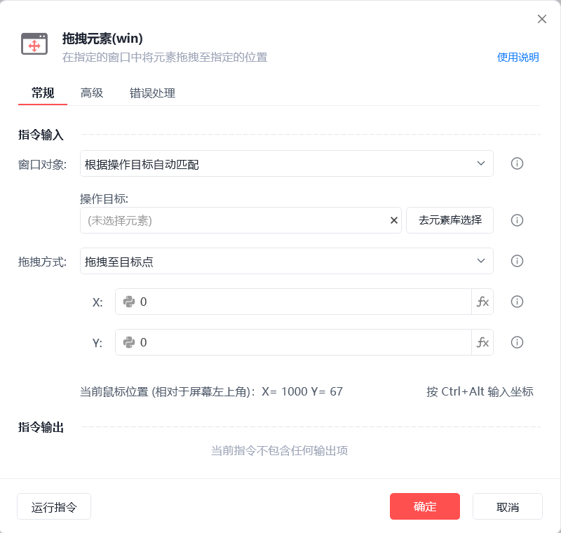
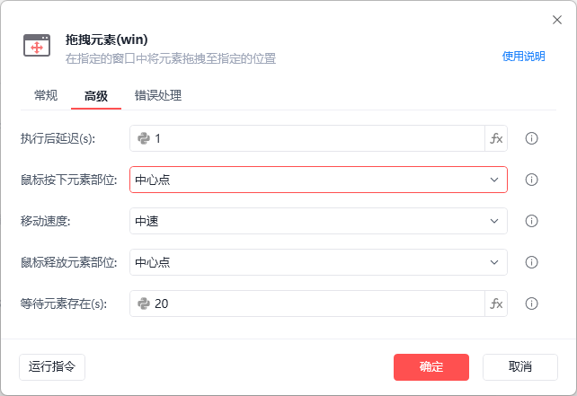
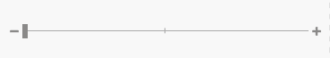

# 拖拽元素(win)

拖拽元素(win)
💡

在指定的窗口中将元素拖拽至指定位置

🎬 视频课程：影刀RPA中级课程：桌面软件＋键鼠自动化

窗口对象

根据操作目标自动匹配或选择一个之前通过【获取窗口对象】指令创建的窗口对象

操作目标

从「元素库」中选择一个已捕获的元素或通过「捕获新元素」来捕获新的窗口元素作为操作目标

拖拽方式

拖拽至目标点：手动输入位置或按Ctrl+Alt输入当前鼠标位置

拖拽至目标元素上：选择一个操作目标

执行后延迟(s)

指令执行完成后的等待时间

鼠标按下元素部位

中心点：元素矩形区域的中心点

随机位置：自动随机元素矩形区域内的点

自定义：手动指定目标点

移动速度

选择移动鼠标的速度

鼠标释放元素部位

同【鼠标按下元素部位】，在指定位置释放鼠标

等待元素存在(s)

等待目标元素存在的超时时间

使用示例

此流程执行逻辑：使用【拖拽元素(win)】指令根据操作目标自动匹配窗口并拖拽滑块至指定位置

## 参数截图

