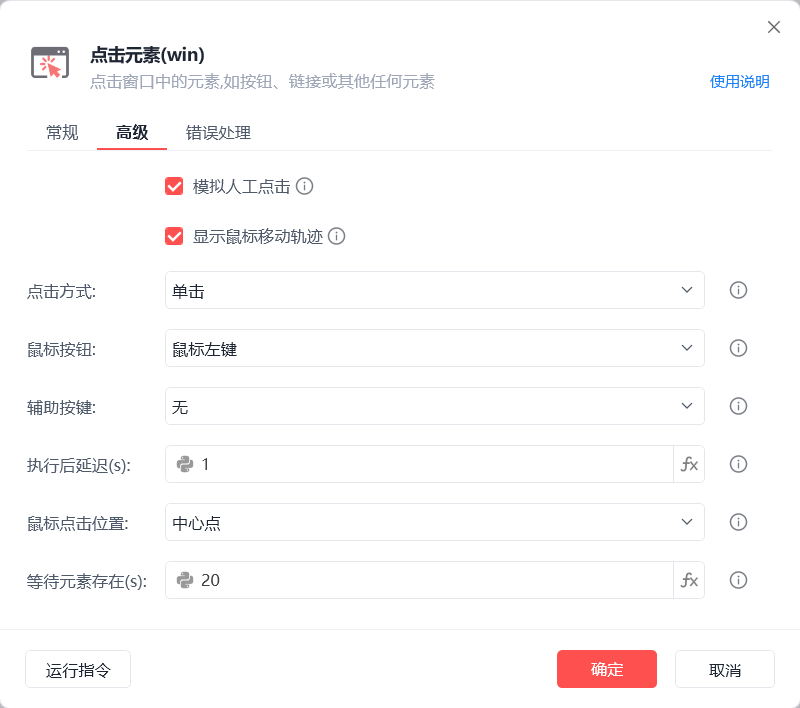

# 点击元素(win)

点击元素(win)
💡

点击窗口中的元素，如按钮、链接或其他任何元素

🎬 视频课程：影刀RPA中级课程：桌面软件＋键鼠自动化

窗口对象

根据操作目标自动匹配或选择一个之前通过【获取窗口对象】指令创建的窗口对象

操作目标

从「元素库」中选择一个已捕获的元素或通过「捕获新元素」来捕获新的窗口元素作为操作目标

模拟人工点击

模拟人工的方式触发点击事件，待点击元素被遮挡时可取消勾选

显示鼠标移动轨迹

鼠标移动的轨迹会完整显示出来或直接显示鼠标移动的最终结果

点击方式

单击/双击

鼠标按钮

左键/右键

辅助按键

无/Alt/Ctrl/Shift/Win

执行后延迟(s)

指令执行完成后的等待时间

鼠标点击位置

中心点：元素矩形区域的中心点

随机位置：自动随机元素矩形区域内的点

自定义：手动指定目标点

注：除中心格外，其余八格的鼠标点击位置如下图所示

中心点：元素矩形区域的中心点

随机位置：自动随机元素矩形区域内的点

自定义：手动指定目标点

注：除中心格外，其余八格的鼠标点击位置如下图所示

等待元素存在(s)

等待目标元素存在的超时时间

使用示例

此流程执行逻辑：执行【获取窗口对象】指令获取记事本窗口 --> 使用【点击元素(win)】指令在窗口对象中模拟人工鼠标左键单击指定元素中心点位置

## 参数截图

