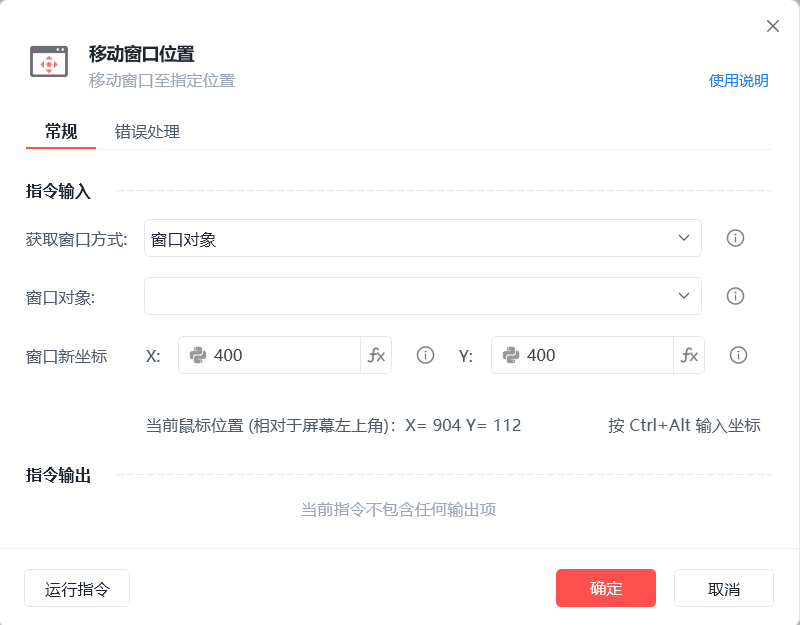

# 移动窗口位置

移动窗口位置
💡

移动窗口至指定位置

🎬 视频课程：影刀RPA中级课程：桌面软件＋键鼠自动化

获取窗口方式

窗口对象：选择一个之前通过【获取窗口对象】指令创建的窗口对象

捕获窗口元素：获取操作目标所在的窗口对象

窗口标题或类型名：从当前可获取的窗口中选择目标窗口标题及类型名(可选)

窗口句柄：获取指定窗口句柄的窗口对象

窗口新坐标

相对于屏幕左上角的位置坐标，可手动输入位置或按Ctrl+Alt输入当前鼠标位置

使用示例

此流程执行逻辑：执行【获取窗口对象】指令获取指定窗口 --> 使用【移动窗口位置】指令移动窗口到指定位置(0,0)即屏幕左上角

## 参数截图

