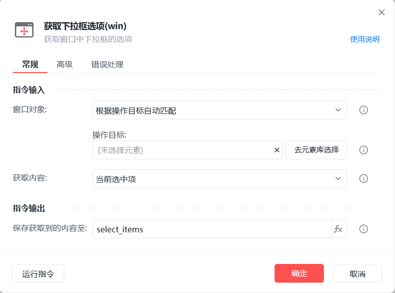
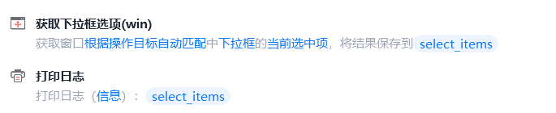

# 获取下拉框选项(win)

获取下拉框选项(win)
💡

获取窗口中下拉框的选项

窗口对象

根据操作目标自动匹配或选择一个之前通过【获取窗口对象】指令创建的窗口对象

操作目标

从「元素库」中选择一个已捕获的元素或通过「捕获新元素」来捕获新的窗口元素作为操作目标

获取内容

当前选中项/全部下拉项

保存获取到的内容至

保存获取到的下拉项内容为变量，变量类型为一维列表

等待元素存在(s)

等待目标元素存在的超时时间

使用示例

此流程执行逻辑：使用【获取下拉框选项(win)】指令获取指定下拉框的当前下拉项并保存结果 --> 执行【打印日志】指令打印保存结果

## 参数截图

