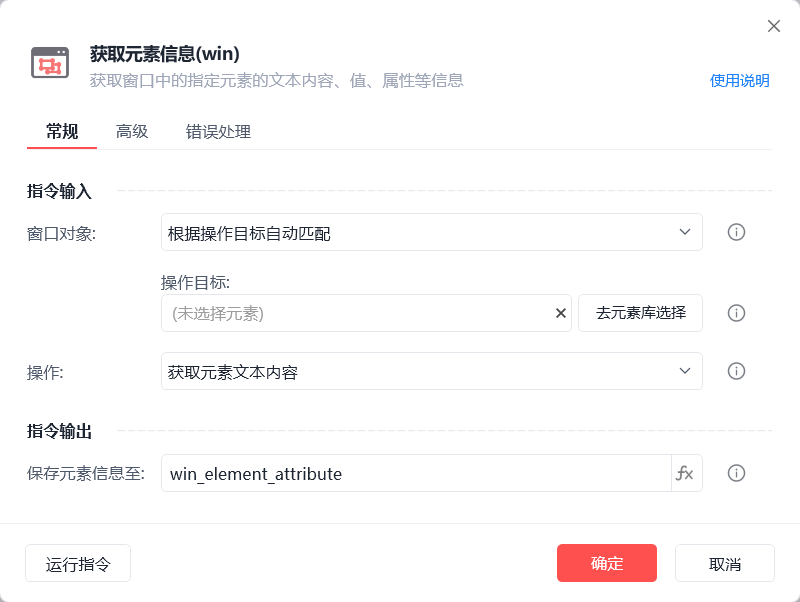
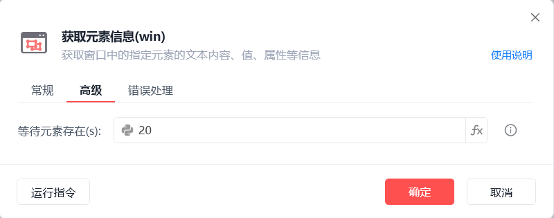
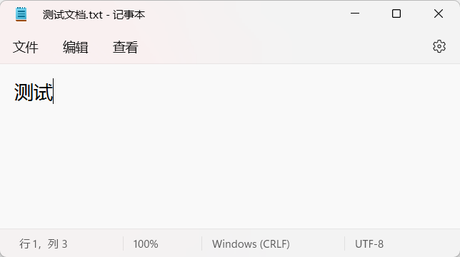
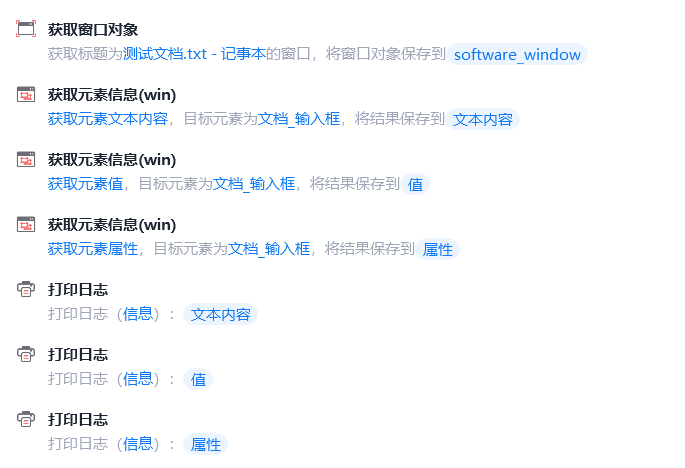
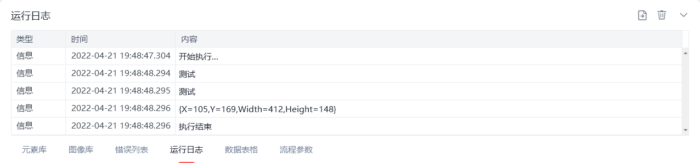

# 获取元素信息(win)

获取元素信息(win)
💡

获取窗口中指定元素的文本内容、值、属性等信息

窗口对象

根据操作目标自动匹配或选择一个之前通过【获取窗口对象】指令创建的窗口对象

操作目标

从「元素库」中选择一个已捕获的元素或通过「捕获新元素」来捕获新的窗口元素作为操作目标

操作

获取元素文本内容：获取可见的文本内容

获取元素值：获取数值

获取元素属性 ：可获取BoundingRectangle(位置宽高)等属性

保存元素信息至

保存获取到的操作结果为变量

等待元素存在(s)

等待目标元素存在的超时时间

使用示例

此流程执行逻辑：执行【获取窗口对象】指令获取指定窗口 --> 使用【获取元素信息(win)】指令分别获取指定元素的文本内容、值、BoundingRectangle属性并保存操作结果 --> 执行【打印日志】指令分别打印操作结果

注：CV元素无法获取元素信息

## 参数截图

