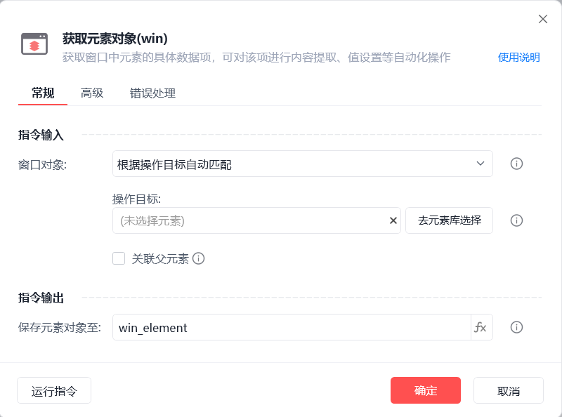
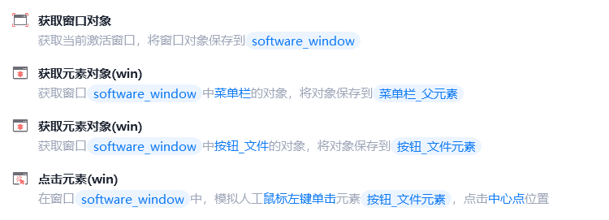

# 获取元素对象(win)

获取元素对象(win)
💡

获取窗口中元素的具体数据项，可对该项进行内容提取、值设置等自动化操作

🎬 视频课程：影刀RPA中级课程：桌面软件＋键鼠自动化

窗口对象

根据操作目标自动匹配或选择一个之前通过【获取窗口对象】指令创建的窗口对象

操作目标

从「元素库」中选择一个已捕获的元素或通过「捕获新元素」来捕获新的窗口元素作为操作目标

关联父元素

在指定父元素中获取元素对象

保存元素对象至

保存获取到的元素对象为变量

等待元素存在(s)

等待目标元素存在的超时时间

使用示例

此流程执行逻辑 获取当前激活窗口 --> 使用【获取元素对象(win)】指令获取菜单栏父元素 --> 使用【获取元素对象(win)】指令关联菜单栏父元素获取指定元素 --> 执行【点击元素(win)】指令点击指定元素

## 参数截图

