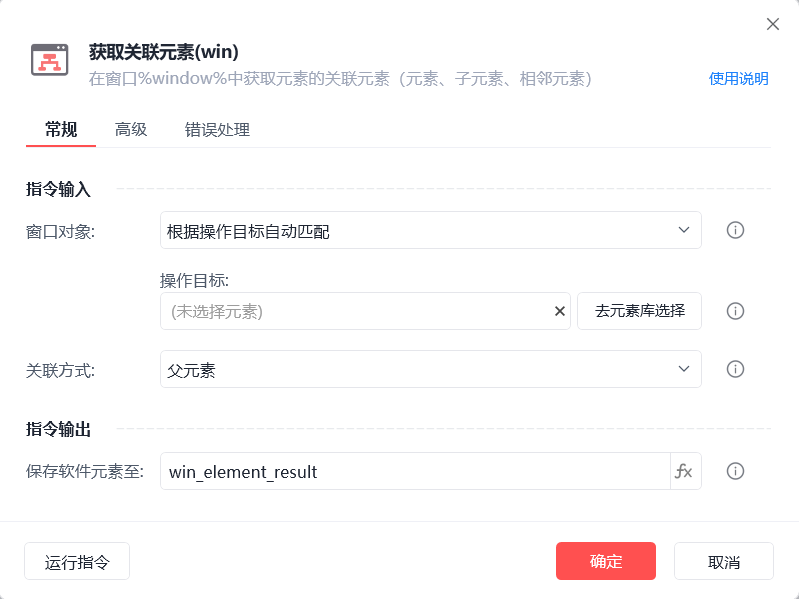
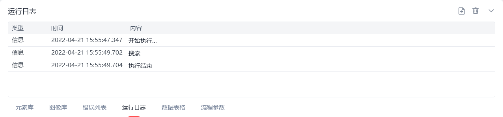

# 获取关联元素(win)

获取关联元素(win)
💡

在窗口中获取元素的关联元素（父元素、子元素、相邻元素）

🎬 视频课程：影刀RPA中级课程：桌面软件＋键鼠自动化

窗口对象

根据操作目标自动匹配或选择一个之前通过【获取窗口对象】指令创建的窗口对象

操作目标

从「元素库」中选择一个已捕获的元素或通过「捕获新元素」来捕获新的窗口元素作为操作目标

关联方式

父元素：关联窗口中上一级元素

子元素：关联所有子元素或指定位置的子元素

相邻元素：关联窗口中同级的上/下一个相邻元素

保存软件元素至

保存获取到的关联元素为变量

等待元素存在(s)

等待目标元素存在的超时时间

注：【获取关联元素(win)】一般主要是用于少数无法直接捕获到的软件元素，可通过捕获其父元素、子元素、相邻元素关联获取

使用示例

此流程执行逻辑：使用【获取关联元素】根据操作目标自动匹配窗口并获取指定元素的下一个相邻元素--> 执行【获取元素信息(win)】指令获取相邻元素文本内容 --> 执行【打印日志】指令打印文本内容

## 参数截图

