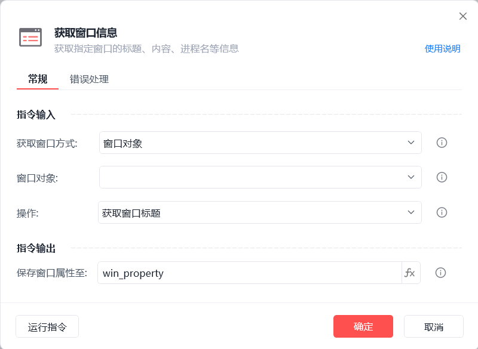
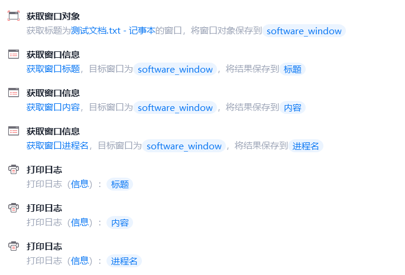
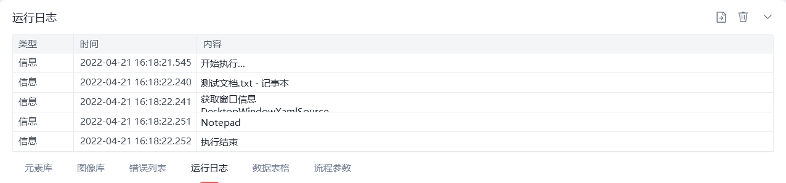

# 获取窗口信息

获取窗口信息
💡

获取指定窗口的标题、内容、进程名等信息

获取窗口方式

窗口对象：选择一个之前通过【获取窗口对象】指令创建的窗口对象

捕获窗口元素：获取操作目标所在的窗口对象

窗口标题或类型名：从当前可获取的窗口中选择目标窗口标题及类型名(可选)

窗口句柄：获取指定窗口句柄的窗口对象

操作

获取窗口标题/内容/进程名

保存窗口属性至

保存窗口信息结果至变量

使用示例

此流程执行逻辑：执行【获取窗口对象】指令获取指定窗口 --> 使用【获取窗口信息】指令分别获取窗口标题、内容、进程名并保存结果 --> 执行【打印日志】指令分别打印保存结果

## 参数截图

