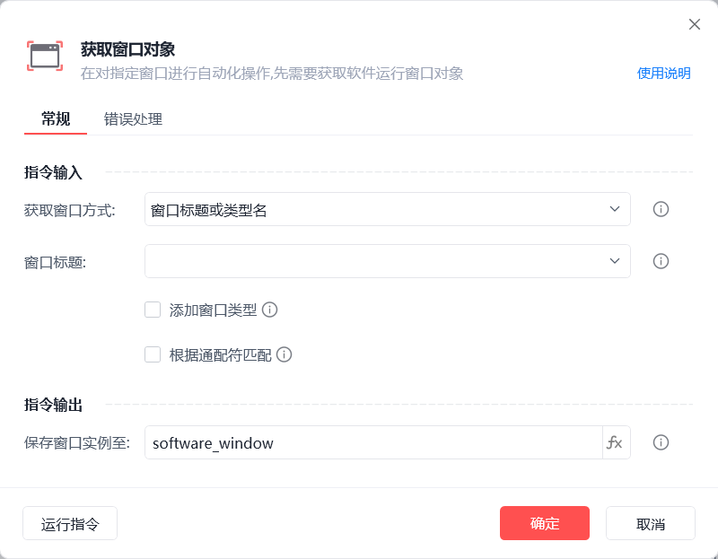
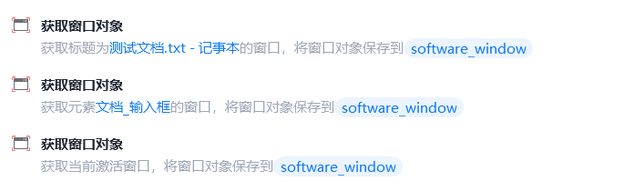

# 获取窗口对象

获取窗口对象
💡

在对指定窗口进行自动化操作前，需要先获取软件运行窗口对象

🎬 视频课程：影刀RPA中级课程：桌面软件＋键鼠自动化

获取窗口方式

窗口标题或类型名：从当前可获取的窗口中选择目标窗口标题及类型名(可选)

捕获窗口元素：获取操作目标所在的窗口对象

当前激活窗口：获取当前系统屏幕上被激活的窗口为窗口对象

窗口句柄：获取指定窗口句柄的窗口对象

桌面：获取桌面为窗口对象

保存窗口实例至

保存窗口对象至变量，后续流程用到该窗口时，可直接调用该变量

使用示例

此流程执行逻辑：使用【获取窗口对象】指令分部通过"窗口标题"、"捕获窗口元素"、"当前激活窗口"的方式获取指定窗口对象

## 参数截图

