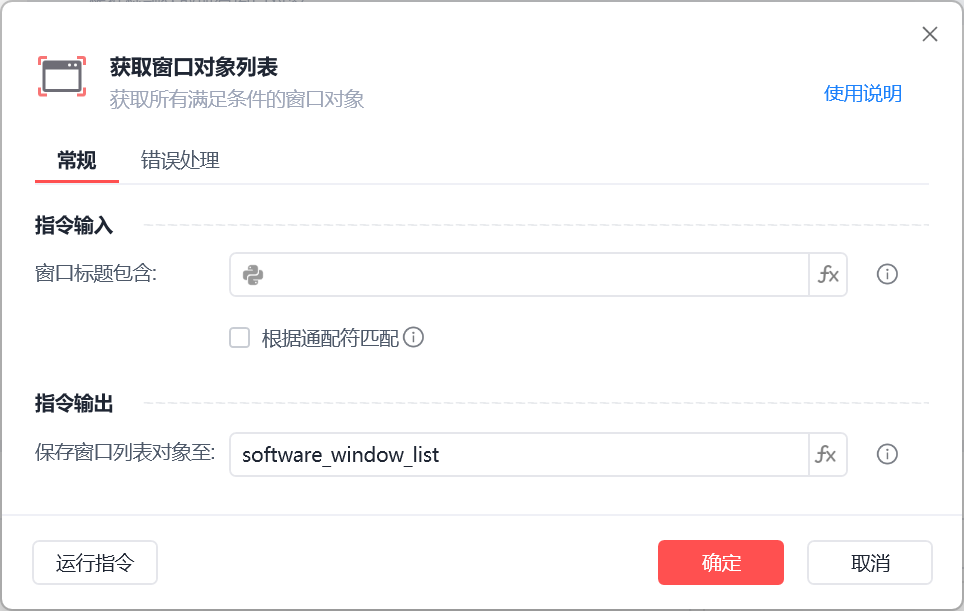

# 获取窗口对象列表

获取窗口对象列表
💡

获取所有满足条件的窗口对象

🎬 视频课程：影刀RPA中级课程：桌面软件＋键鼠自动化

窗口标题包含

获取窗口方式

包含匹配：直接填写窗口标题包含，可获取包含该标题文字的窗口列表

根据通配符匹配：勾选根据通配符匹配，可获取标题与通配符相匹配的窗口列表

保存窗口实例至

保存窗口对象至变量，后续流程用到该窗口时，可直接调用该变量

使用示例

包含匹配示例

根据通配符匹配示例

此流程执行逻辑：使用【获取窗口对象列表】指令分别通过“包含匹配”和“根据通配符匹配”的方式获取指定窗口对象列表。

## 参数截图
