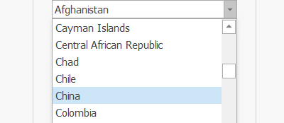

# 设置下拉框(win)

设置下拉框(win)
💡

设置窗口中下拉框的选中项

🎬 视频课程：影刀RPA中级课程：桌面软件＋键鼠自动化

窗口对象

根据操作目标自动匹配或选择一个之前通过【获取窗口对象】指令创建的窗口对象

操作目标

从「元素库」中选择一个已捕获的元素或通过「捕获新元素」来捕获新的窗口元素作为操作目标

选择方式

按选项内容选择/按选项位置选择

选择值

设置待选择的选项具体内容或选项的具体位置

匹配方式

模糊匹配/精准匹配/正则匹配

执行后延迟(s)

指令执行完成后的等待时间

等待元素存在(s)

等待目标元素存在的超时时间

使用示例

此流程执行逻辑：使用【设置下拉框(web)】指令按选项内容选择

## 参数截图

