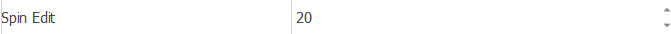

# 设置元素值(win)

设置元素值(win)
💡

设置窗口元素的值，一般用于输入框和下拉框的操作

🎬 视频课程：影刀RPA中级课程：桌面软件＋键鼠自动化

窗口对象

根据操作目标自动匹配或选择一个之前通过【获取窗口对象】指令创建的窗口对象

操作目标

从「元素库」中选择一个已捕获的元素或通过「捕获新元素」来捕获新的窗口元素作为操作目标

元素值

设置"input"、"select"等元素的value

等待元素存在(s)

等待目标元素存在的超时时间

使用示例

此流程执行逻辑：使用【设置元素值(win)】指令根据操作目标自动匹配窗口并设置值为20

## 参数截图

