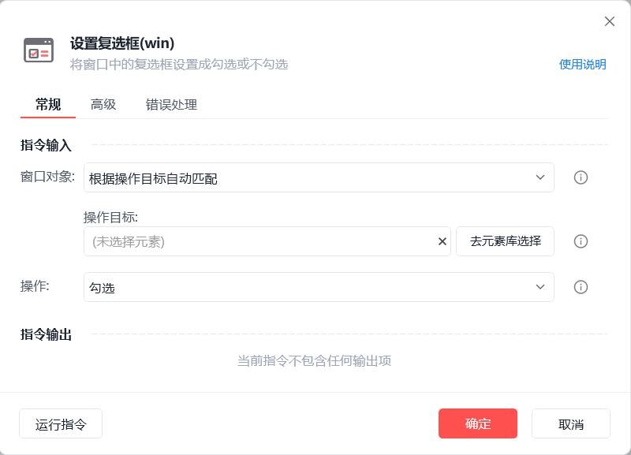

# 设置复选框(win)

设置复选框(win)
💡

将窗口中的复选框设置成勾选或不勾选

🎬 视频课程：影刀RPA中级课程：桌面软件＋键鼠自动化

窗口对象

根据操作目标自动匹配或选择一个之前通过【获取窗口对象】指令创建的窗口对象

操作目标

从「元素库」中选择一个已捕获的元素或通过「捕获新元素」来捕获新的窗口元素作为操作目标

操作

勾选/取消勾选/反选

执行后延迟(s)

指令执行完成后的等待时间

等待元素存在(s)

等待目标元素存在的超时时间

使用示例

此流程执行逻辑：使用【设置复选框(win)】指令根据操作目标自动匹配窗口并勾选指定复选框

## 参数截图

