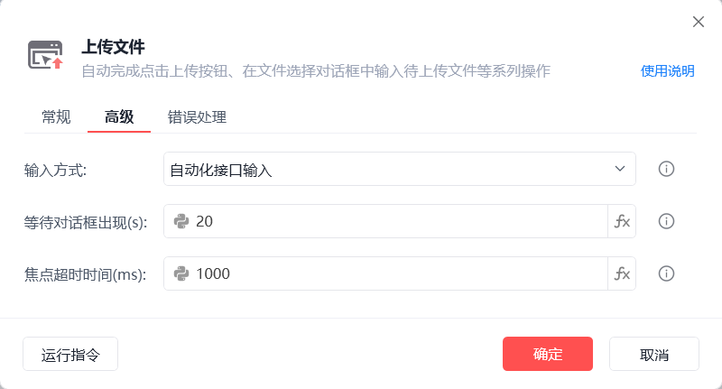

# 上传文件

上传文件
💡

自动完成点击上传按钮、在文件选择对话框中输入待上传文件等系列操作

🎬 视频课程：影刀RPA中级课程： 网页自动化-进阶

网页对象

待执行上传操作的目标页面

操作目标

从「元素库」中选择一个已捕获的元素或通过「捕获新元素」来捕获新的网页元素作为操作目标，操作目标为点击后可弹出文件上传对话框的那个上传按钮

上传文件路径

可在文本输入模式手动输入上传文件路径，如："C:\测试文档.txt"

可在Python输入模式下输入标准的文件路径表达式，支持多文件上传，如：["C:\\1.txt", "C:\\2.txt"]

可通过选择包含有目标文件路径的变量，支持多文件上传

输入方式

自动化接口输入：调用文件名输入框自身实现的自动化接口输入

剪切板输入：将文件路径和文件名添加到剪切板，通过Ctrl+V操作将内容填写到上传对话框中

模拟人工输入：通过模拟人工的方式触发输入事件

等待对话框出现(s)

点击上传按钮后，等待上传对话框出现的超时时间

焦点超时时间(ms)

设置获取输入框焦点的超时时间

使用示例

此流程执行逻辑：打开影刀商城网页 --> 使用【上传文件】指令上传多个指定文件

部分情况下，当系统快捷键[Alt+D]被其他软件占用时，会影响此指令运行

## 参数截图

