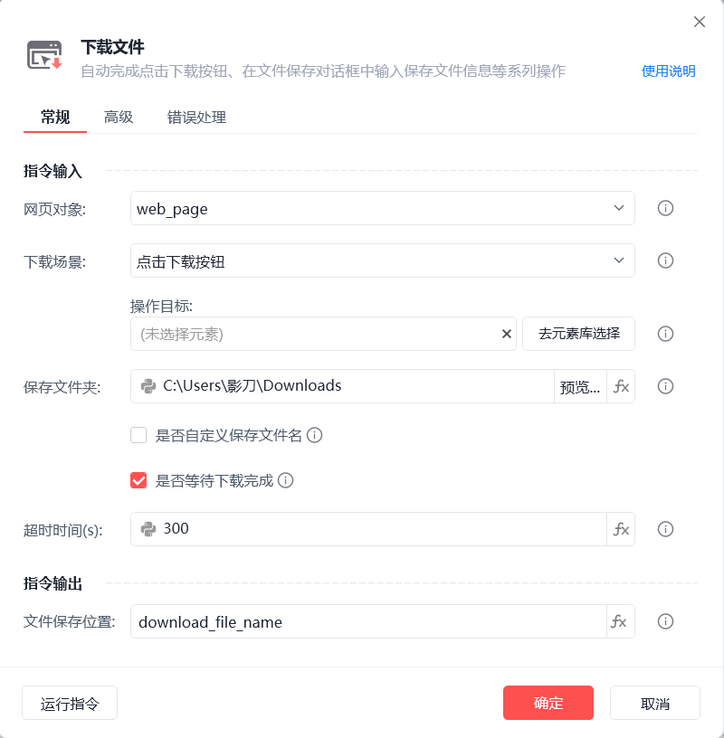
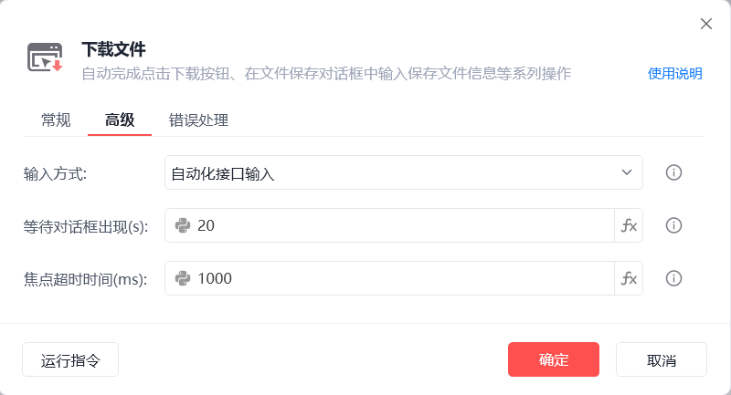
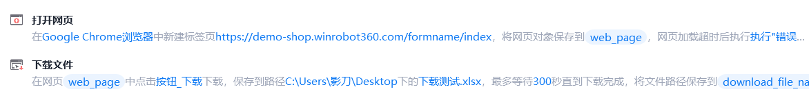

# 下载文件

下载文件
💡

自动完成点击下载按钮、在文件保存对话框中输入保存文件信息等系列操作

网页对象

待执行下载操作的目标页面

下载场景

点击下载按钮/指定下载地址

保存文件夹

保存下载文件的文件夹路径

是否自定义保存文件名

支持自定义文件名，若不勾选则使用默认文件名，若没有默认文件名，则程序自动生成不重复的文件名

是否等待下载完成

若勾选则会在最大超时时间内一直等待，直到文件下载完成，若超时未下载完成执行「错误处理」

文件保存位置

保存下载文件所在的路径信息为变量

输入方式

自动化接口输入：调用文件名输入框自身实现的自动化接口输入

剪切板输入：将文件路径和文件名添加到剪切板，通过Ctrl+V操作将内容填写到上传对话框中

模拟人工输入：通过模拟人工的方式触发输入事件

等待对话框出现(s)

点击下载按钮后，等待下载对话框出现的超时时间

焦点超时时间(ms)

设置获取输入框焦点的超时时间

使用示例

此流程执行逻辑：打开影刀商城网页 --> 使用【下载文件】下载文件至指定路径并自定义文件名

常见问题

下载文件报错相关

## 参数截图

