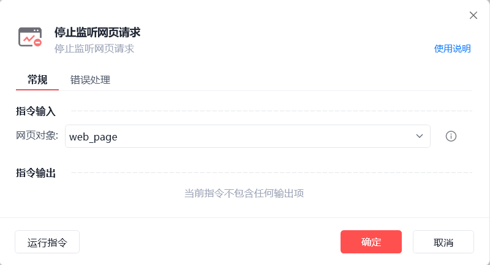

# 停止监听网页请求

停止监听网页请求
💡

停止监听网页请求,新的网页响应将不再记录

🎬 视频课程：【影刀RPA专题教程】HTTP&网页监听

🎬 视频课程：数据获取

网页对象

选择一个之前通过【打开网页】或【获取已打开的网页对象】指令创建的网页对象

使用示例

此流程执行逻辑：打开影刀官网 --> 【开始监听网页请求】 --> 执行【跳转至新网址】重新加载网页 --> 【获取网页请求结果】 --> 使用【停止监听网页】结束抓取指定网页中的请求信息 --> 执行【打印日志】指令打印监听结果

常见问题

如何使用网页监听指令获取数据

## 参数截图

