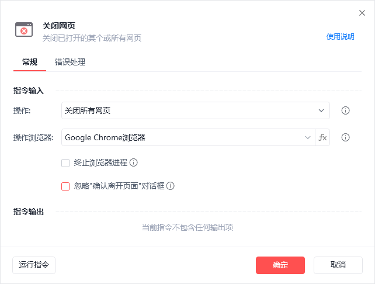
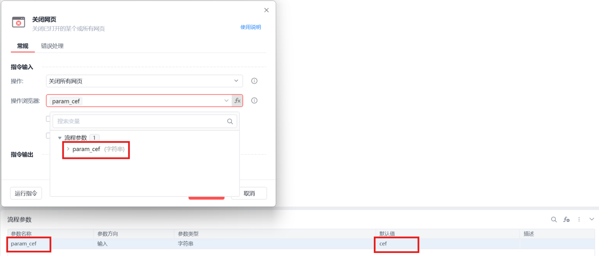

# 关闭网页

关闭网页
💡

关闭已打开的某个或所有网页

🎬 视频课程：影刀RPA中级课程： 网页自动化-进阶

操作

关闭指定网页：选择待关闭的网页对象

关闭所有网页：选择待操作的浏览器，可选择终止指定浏览器进程和关联的所有子进程

浏览器类型支持fx变量：

终止浏览器进程：如果勾选,将强制结束属于当前用户的指定浏览器进程和由它启动的所有子进程

忽略"确认离开页面"对话框：启用后,将忽略浏览器弹出的"确认离开页面"提示，仅适用于Chrome、Edge、360安全浏览器和其它自定义浏览器

  “忽略"确认离开页面"对话框  ——  该功能在5.25版本上线

浏览器类型

	

变量值

影刀浏览器

	

cef

Google Chrome浏览器

	

chrome

Microsoft Edge浏览器

	

edge

Internet Explorer浏览器

	

ie

360浏览器

	

360se

Firefox

	

firefox

QQ浏览器(自定义)

	

QQBrowser

例如：

使用示例

此流程执行逻辑：【打开网页】并保存网页对象 --> 执行【打印日志】指令 --> 使用【关闭网页】指令关闭指定网页对象

## 参数截图

