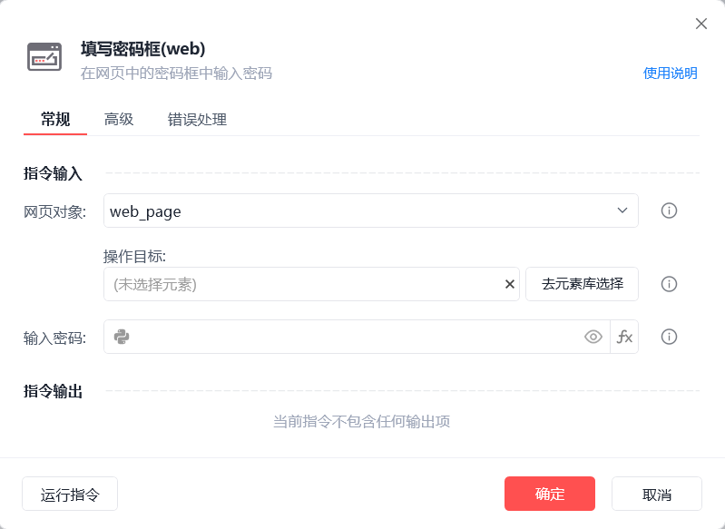
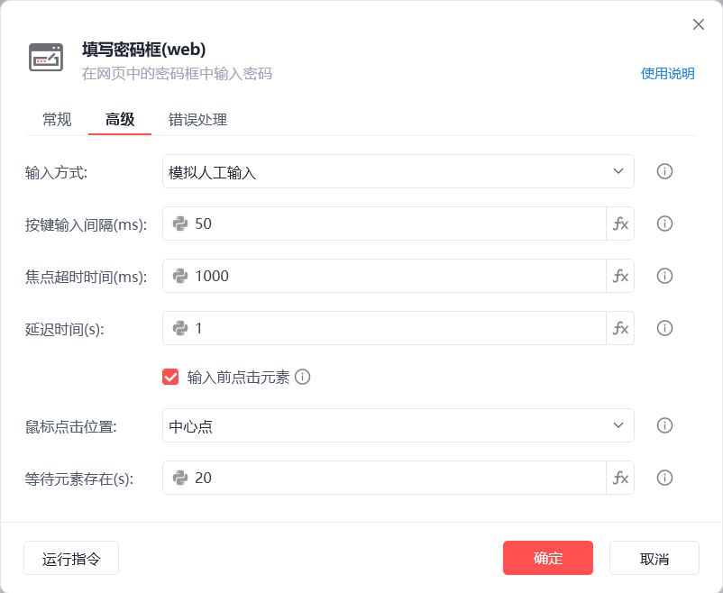
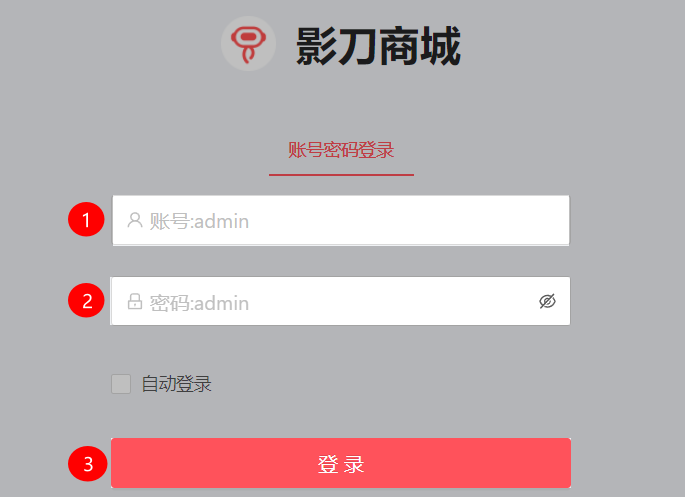
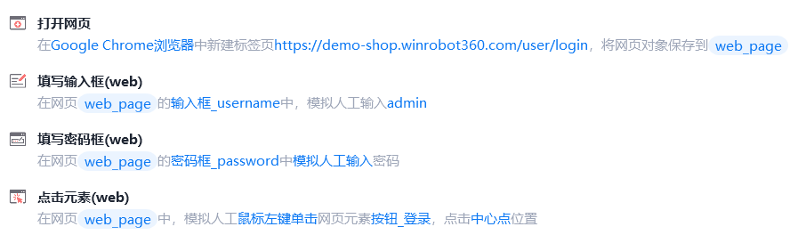

# 填写密码框(web)

填写密码框(web)
💡

在网页的密码框中输入密码

🎬 视频课程：影刀RPA中级课程： 网页自动化-进阶

网页对象

选择一个之前通过【打开网页】或【获取已打开的网页对象】指令创建的网页对象

操作目标

从「元素库」中选择一个已捕获的元素或通过「捕获新元素」来捕获新的网页元素作为操作目标

输入密码

以隐藏的方式键入密码

以 显示的方式键入密码

输入方式

选择输入方式

	

适用范围

	

理由

模拟人工输入

	

绝大多数网页输入框

	

像人工敲字，几乎所有网页都支持，兼容性最好。（会自动切换当前的输入法为英文输入状态，避免输入法造成的错误

注：对于谷歌系浏览器，如开启【运行时不抢占鼠标键盘】（影刀浏览器默认开启），会直接使用谷歌系浏览器接口输入）

谷歌系浏览器接口输入（稳定）

	

Chrome/Edge 等 Chromium 内核浏览器

	

通过Chromium接口直接发送输入事件，速度快、稳定性高，不受窗口状态干扰，避免被拦截

剪贴板输入

	

富文本、HTML、含换行的输入内容

	

保留格式与特殊字符，绕开输入法干扰

自动化接口输入

	

依赖网页处理输入事件

	

调用元素自身实现的自动化接口输入

按键输入间隔(ms)

两次按键输入的间隔时间，若输入内容出错可适当延长

焦点超时时间(ms)

设置获取输入框焦点的超时时间

延迟时间(s)

指令执行完成后的等待时间

输入前点击元素

在执行输入动作前先点击元素，以便获取焦点

鼠标点击位置

中心点：元素矩形区域的中心点

随机位置：自动随机元素矩形区域内的点

自定义：手动指定目标点

等待元素存在(s)

等待目标元素存在的超时时间

使用示例

此流程执行逻辑：打开影刀商城网页 --> 执行【填写输入框(web)】指令填写账号 --> 使用【填写密码框(web)】指令填写密码 --> 执行【点击元素(web)】指令点击"登录"按钮

## 参数截图

