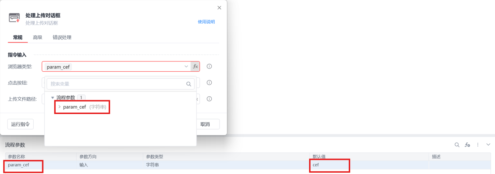

# 处理上传对话框

处理上传对话框
💡

处理上传对话框

浏览器类型

影刀浏览器，支持静默运行

Google Chrome浏览器,插件安装说明

Microsoft Edge浏览器插件安装说明

Internet Explorer浏览器

360浏览器插件安装说明

Firefox浏览器插件安装说明

浏览器类型支持fx变量：

浏览器类型

	

变量值

影刀浏览器

	

cef

Google Chrome浏览器

	

chrome

Microsoft Edge浏览器

	

edge

Internet Explorer浏览器

	

ie

360浏览器

	

360se

Firefox

	

firefox

QQ浏览器(自定义)

	

QQBrowser

例如：

点击按钮

确定/取消

上传文件路径：

可在文本输入模式手动输入上传文件路径，如："C:\测试文档.txt"

可在Python输入模式下输入标准的文件路径表达式，支持多文件上传，如：["C:\\1.txt", "C:\\2.txt"]

可通过选择包含有目标文件路径的变量，支持多文件上传

输入方式：

自动化接口输入：调用文件名输入框自身实现的自动化接口输入

剪切板输入：将文件路径和文件名添加到剪切板，通过Ctrl+V操作将内容填写到上传对话框中

模拟人工输入：通过模拟人工的方式触发输入事件

等待对话框出现(s)

点击下载按钮后，等待下载对话框出现的超时时间

焦点超时时间(ms)

设置获取输入框焦点的超时时间

使用示例

此流程执行逻辑：打开影刀商城网页 --> 执行【点击元素(web)】指令点击上传按钮 --> 使用【处理上传对话框】上传指定文件

## 参数截图

