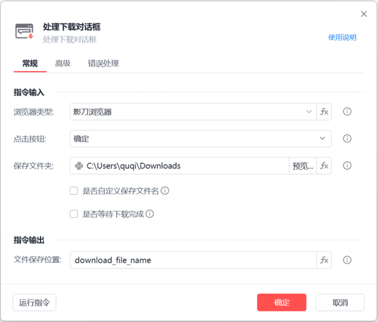
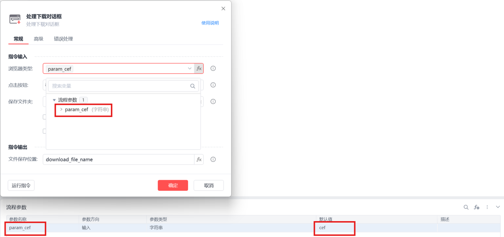
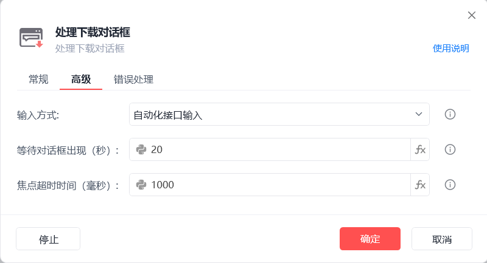
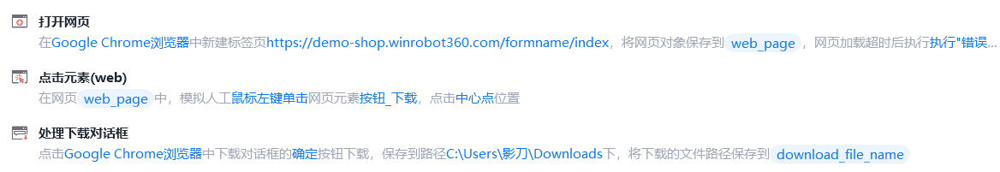

# 处理下载对话框

处理下载对话框
💡

处理下载对话框

浏览器类型

影刀浏览器，支持静默运行

Google Chrome浏览器,插件安装说明

Microsoft Edge浏览器插件安装说明

Internet Explorer浏览器

Firefox浏览器插件安装说明

浏览器类型支持fx变量：

浏览器类型

	

变量值

影刀浏览器

	

cef

Google Chrome浏览器

	

chrome

Microsoft Edge浏览器

	

edge

Internet Explorer浏览器

	

ie

360浏览器

	

360se

Firefox

	

firefox

QQ浏览器(自定义)

	

QQBrowser

例如：

点击按钮

确定/取消

保存文件夹

保存下载文件的文件夹路径

是否自定义保存文件名

支持自定义文件名，若不勾选则使用默认文件名，若没有默认文件名，则程序自动生成不重复的文件名

是否等待下载完成

若勾选则会在最大超时时间内一直等待，直到文件下载完成，若超时未下载完成执行「错误处理」

文件保存位置

保存下载文件所在的路径信息为变量

输入方式

自动化接口输入：调用文件名输入框自身实现的自动化接口输入

剪切板输入：将文件路径和文件名添加到剪切板，通过Ctrl+V操作将内容填写到上传对话框中

模拟人工输入：通过模拟人工的方式触发输入事件

等待对话框出现(s)

点击上传按钮后，等待上传对话框出现的超时时间

焦点超时时间(ms)

设置获取输入框焦点的超时时间

使用示例

此流程执行逻辑：打开影刀商城网页 --> 执行【点击元素(web)】指令点击下载按钮 --> 使用【处理下载对话框】下载文件至指定路径并保存文件路径

常见问题

处理下载对话框报错相关

## 参数截图

