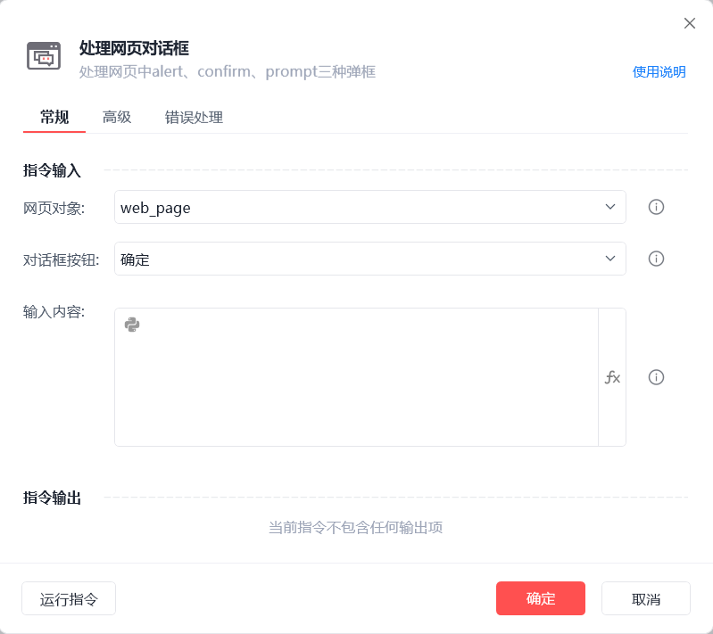

# 处理网页对话框

处理网页对话框
💡

处理网页中alert、confirm、prompt三种弹框

网页对象

待执行处理对话框操作的目标页面

对话框按钮

确定/取消

输入内容

若出现的对话框是支持输入的，可在此填写要输入的内容

等待对话框出现(s)

等待网页对话框出现的超时时间

使用示例

此流程执行逻辑：【获取已打开的网页对象】 --> 使用【处理网页对话框】指令在指定网页的对话框中输入内容并点击"确定"按钮

## 参数截图

