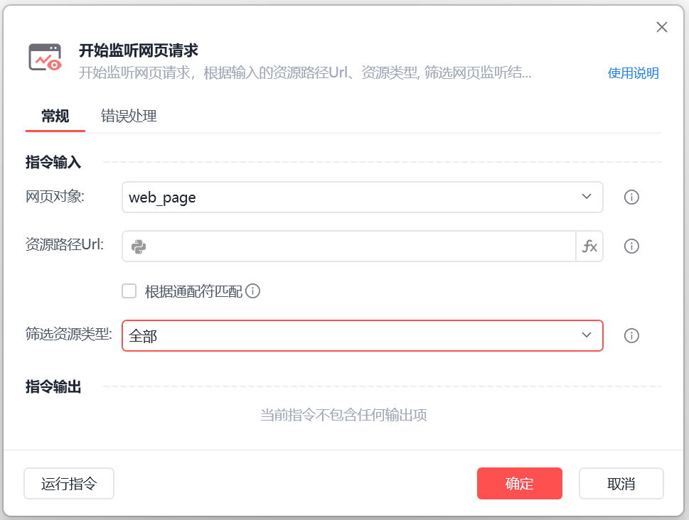
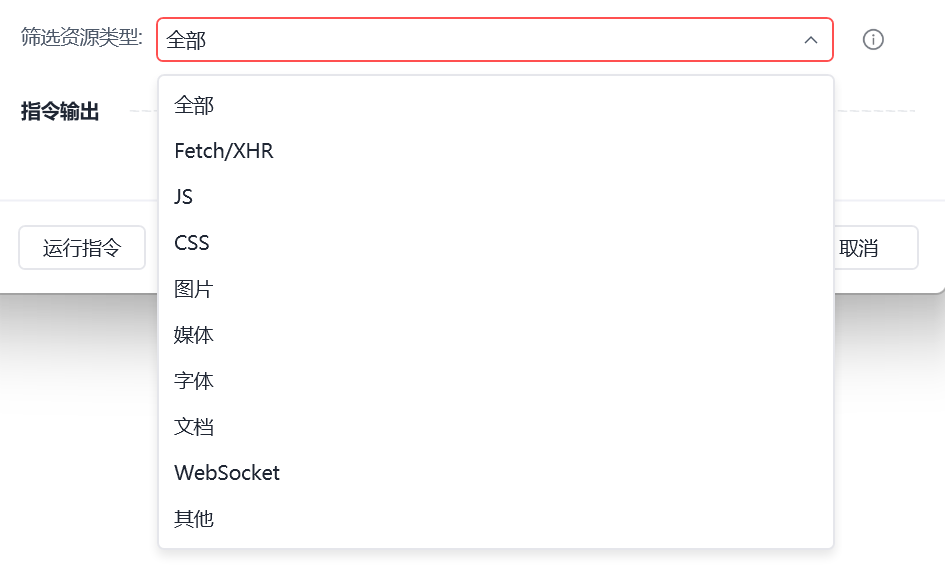
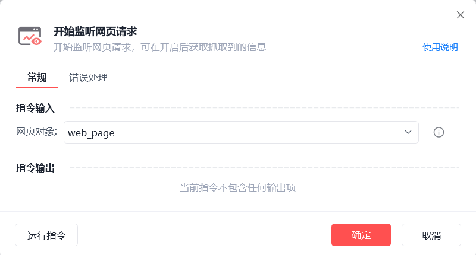
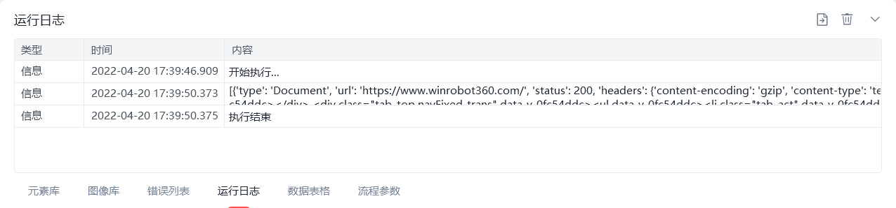

# 开始监听网页请求

开始监听网页请求
💡

开始监听网页请求,可在开启后获取抓取到的请求响应信息

🎬 视频课程：【影刀RPA专题教程】HTTP&网页监听

🎬 视频课程：数据获取

为了兼容老版本影刀，获取网页监听结果指令存在两种界面

新版本界面

旧版本界面

以下为新版本介绍
配置项说明

网页对象

选择一个之前通过【打开网页】或【获取已打开的网页对象】指令创建的网页对象

资源路径 URL

根据输入的资源 URL ,筛选网页监听结果(值为空则忽略 URL 筛选条件)

根据通配符匹配

根据通配符筛选 URL

筛选资源类型

选择要获取的网页监听结果类型,可筛选JS,图片,文档等类型

应用示例文档 如何使用网页监听指令抓取数据

使用示例

此流程执行逻辑：获取已打开的网页对象 --> 开始监听网页请求 --> 跳转至新网址（重新加载） --> 获取网页请求结果 --> 停止监听网页 --> 打印日志（网页请求结果会以列表的形式呈现）。

以下为老版本介绍
配置项说明

网页对象

选择一个之前通过【打开网页】或【获取已打开的网页对象】指令创建的网页对象

使用示例

此流程执行逻辑：打开影刀官网 --> 使用【开始监听网页请求】开始抓取指定网页中的请求信息 --> 执行【跳转至新网址】重新加载网页 --> 【获取网页请求结果】 --> 【停止监听网页】 --> 执行【打印日志】指令打印监听结果

常见问题

如何使用网页监听指令获取数据

## 参数截图

