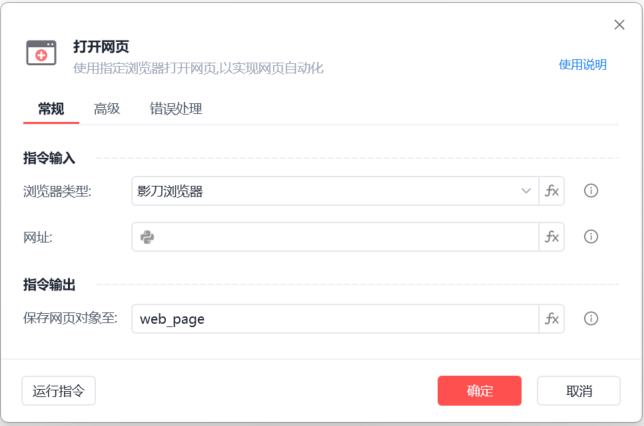
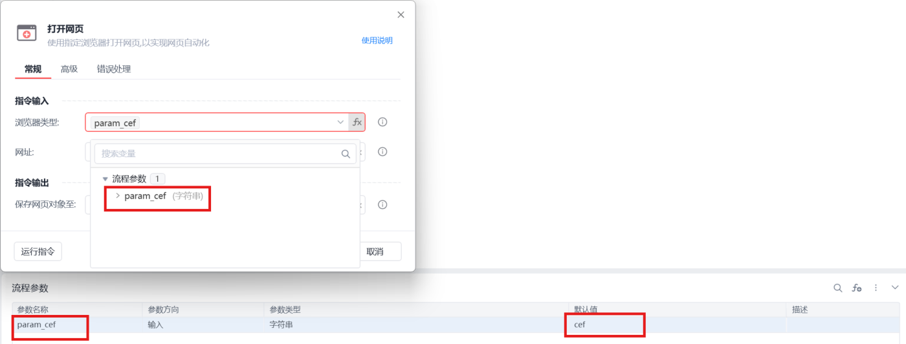
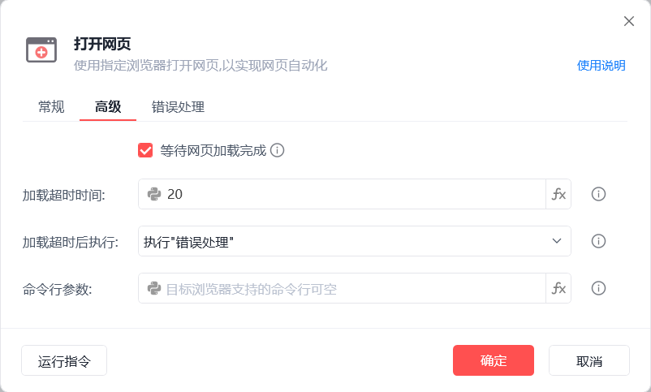

# 打开网页

打开网页
💡

使用指定浏览器打开网页，以实现网页自动化

🎬 视频课程：影刀RPA中级课程： 网页自动化-进阶

浏览器类型

影刀浏览器，支持静默运行

Chrome，Edge，360浏览器，支持运行时不抢占鼠标键盘

Google Chrome浏览器,插件安装说明

Microsoft Edge浏览器插件安装说明

Internet Explorer浏览器

360浏览器插件安装说明

Firefox浏览器插件安装说明

自定义浏览器：自定义浏览器使用说明

浏览器类型支持fx变量：

浏览器类型

	

变量值

影刀浏览器

	

cef

Google Chrome浏览器

	

chrome

Microsoft Edge浏览器

	

edge

Internet Explorer浏览器

	

ie

360浏览器

	

360se

Firefox

	

firefox

QQ浏览器(自定义)

	

QQBrowser

例如：

网址

输入需要打开的网址

保存网页对象至

保存网页对象至变量，后续流程用到该网页时，可直接调用该变量

等待网页加载完成

设置网页加载超时时间，加载超时后执行「错误处理」或停止网页加载，单位为秒

命令行参数

必须是目标浏览器支持的命令行，可为空

Chrome常用命令行参数

	

作用

--incognito

	

进入无痕浏览模式——保证浏览网页时，不留下任何痕迹

--user-data-dir="绝对路径"

	

指定UserData路径，默认路径位于系统盘，通过该命令可重定向为其它分区

--disable-plugins

	

禁止加载所有插件

--start-maximized

	

浏览器启动后，窗口默认为最大化

......

	

......

使用示例

此流程执行逻辑：使用【打开网页】指令打开指定网址并保存网页对象

常见问题

Chrome浏览器安装在C盘以外的硬盘

Chrome浏览器每次打开时都重置设置

无效的窗口句柄

## 参数截图

