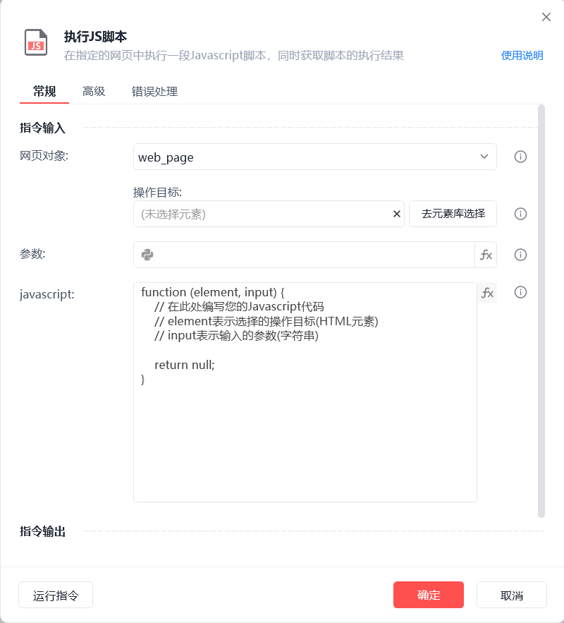
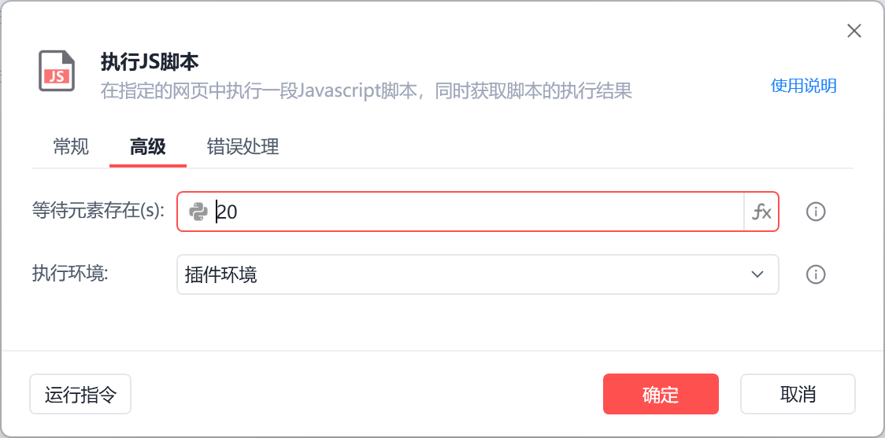
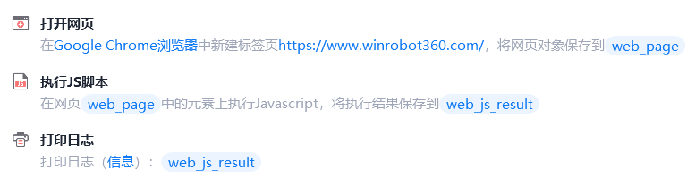
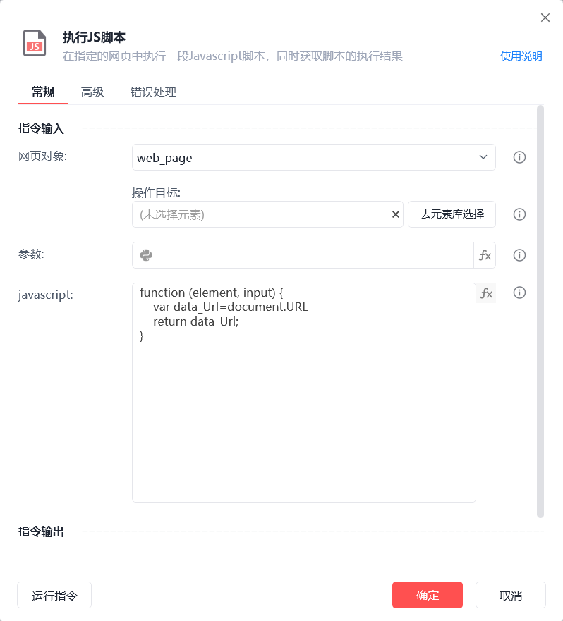
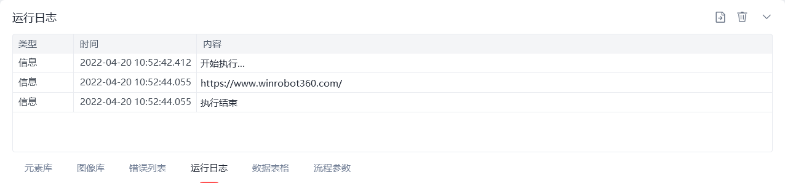

# 执行JS脚本

执行JS脚本
💡

在指定的网页中执行一段Javascript脚本，同时获取脚本的执行结果

网页对象

选择一个之前通过【打开网页】或【获取已打开的网页对象】指令创建的网页对象

参数

待传入到Javascript脚本的参数s

javascript

编写一段用于执行的Javascript脚本

存储脚本执行结果至

保存Javascript程序的运行结果为变量，供后续流程调用

等待元素存在(s)

等待目标元素存在的超时时间

此流程执行逻辑：打开影刀官网 --> 使用【执行JS脚本】指令在指定网页对象上执行Javascript脚本并保存执行结果 --> 执行【打印日志】指令打印

## 参数截图

