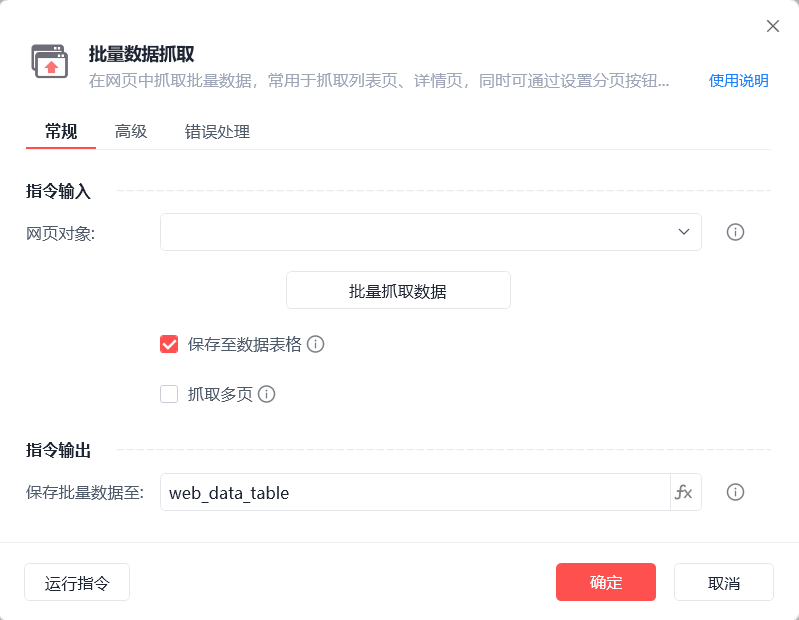
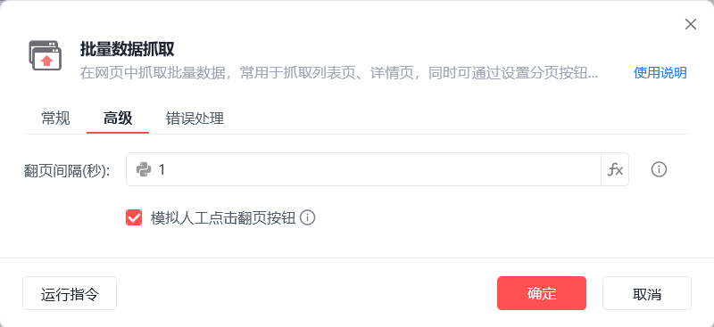
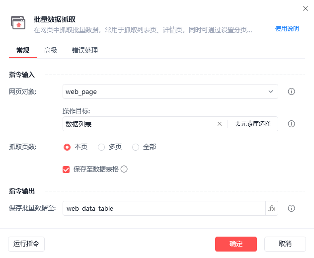
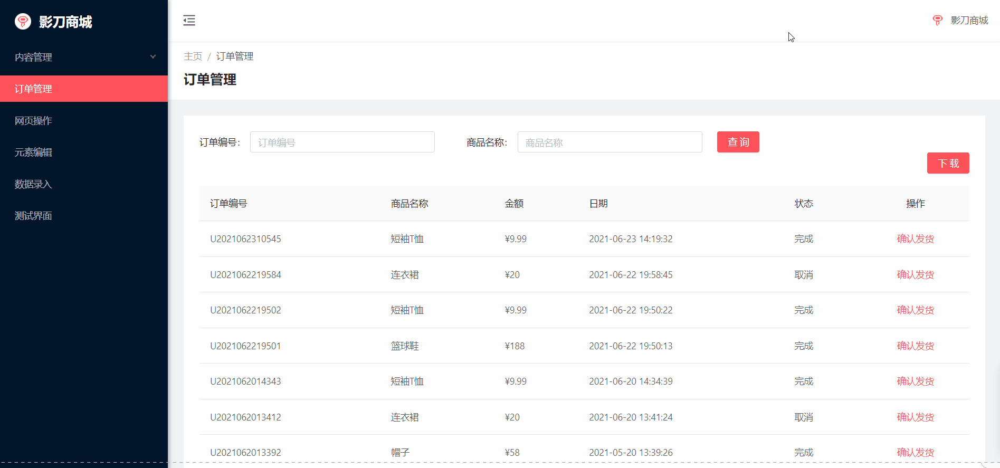
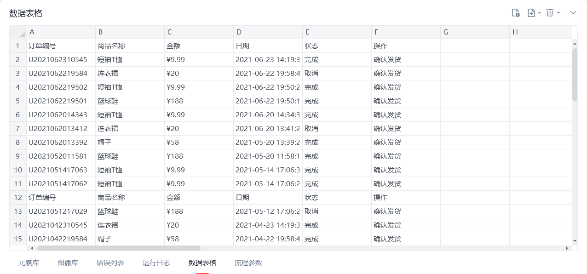

# 批量数据抓取

批量抓取数据
💡

在网页中抓取批量数据，常用于抓取列表页、详情页，同时可通过设置分页按钮抓取多页数据

网页对象

选择一个之前通过【打开网页】或【获取已打开的网页对象】指令创建的网页对象

批量抓取数据

点击后启动「批量数据抓取」，操作类似于「捕获新元素」

保存至数据表格

保存抓取到的数据至影刀内置数据表格中

抓取多页

抓取多页数据，需设置"下一页按钮"及"抓取页数"

保存批量数据至

保存获取到的批量数据为变量，变量为二维列表类型

翻页间隔(秒)

设置在抓取数据前的等待时间，主要是用于准确获取某些动态加载的数据

模拟人工点击翻页按钮

模拟人工的方式触发点击事件，"翻页按钮"被遮挡时可取消勾选

使用示例

此流程执行逻辑：打开影刀商城网页 --> 使用【批量数据抓取】指令抓取3页数据，并将结果保存至变量及数据表格

## 参数截图

