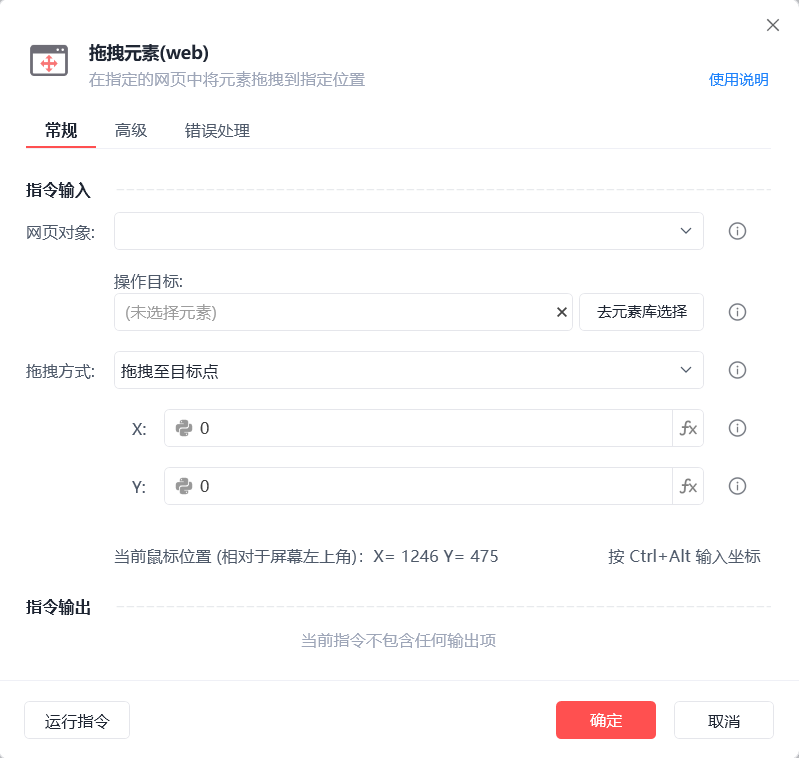
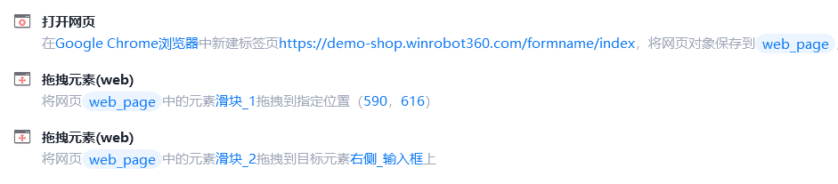
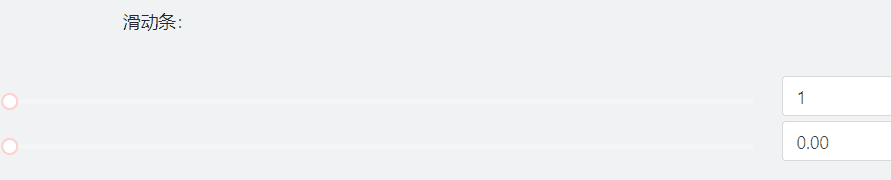

# 拖拽元素(web)

拖拽元素(web)
💡

在指定的网页中将元素拖拽到指定位置

🎬 视频课程：影刀RPA中级课程： 网页自动化-进阶

网页对象

选择一个之前通过【打开网页】或【获取已打开的网页对象】指令创建的网页对象

操作目标

从「元素库」中选择一个已捕获的元素或通过「捕获新元素」来捕获新的网页元素作为操作目标

拖拽方式

拖拽至目标点：手动输入位置或按Ctrl+Alt输入当前鼠标位置

拖拽至目标元素上：选择一个操作目标

延迟时间(s)

指令执行完成后的等待时间

鼠标按下位置

中心点：元素矩形区域的中心点

随机位置：自动随机元素矩形区域内的点

自定义：手动指定目标点

鼠标释放位置

同上，在指定位置鼠标释放

等待元素存在(s)

等待目标元素存在的超时时间

使用示例

此流程执行逻辑：打开影刀商城网页 --> 使用【拖拽元素(web)】指令拖拽滑块至指定位置 --> 使用【拖拽元素(web)】指令拖拽滑块至目标元素

## 参数截图

