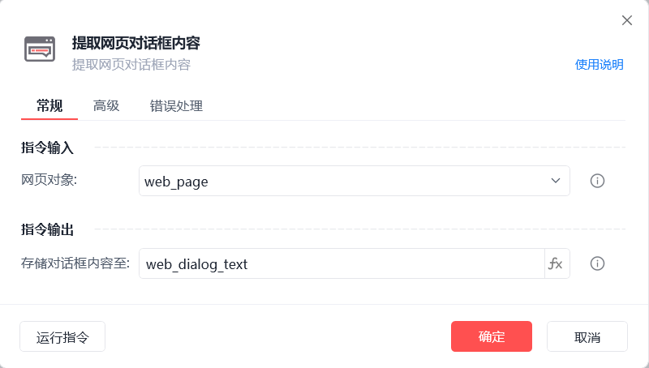
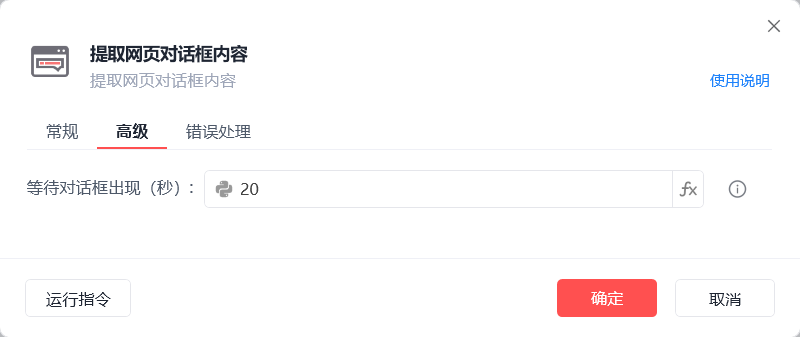
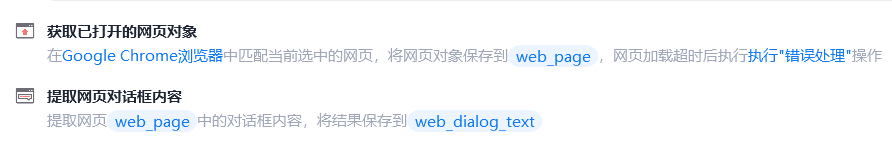

# 提取网页对话框内容

提取网页对话框内容
💡

提取网页对话框内容

🎬 视频课程：影刀RPA中级课程： 网页自动化-进阶

网页对象

选择一个之前通过【打开网页】或【获取已打开的网页对象】指令创建的网页对象

存储对话框内容至

保存获取到的对话框内容为变量

等待元素存在(s)

等待目标元素存在的超时时间

使用示例

此流程执行逻辑：【获取已打开的网页对象】 --> 使用【提取网页对话框内容】指令提取对话框文本内容并保存结果

## 参数截图

