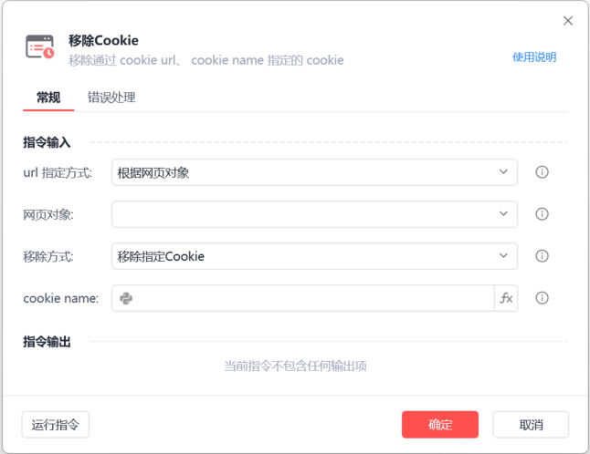
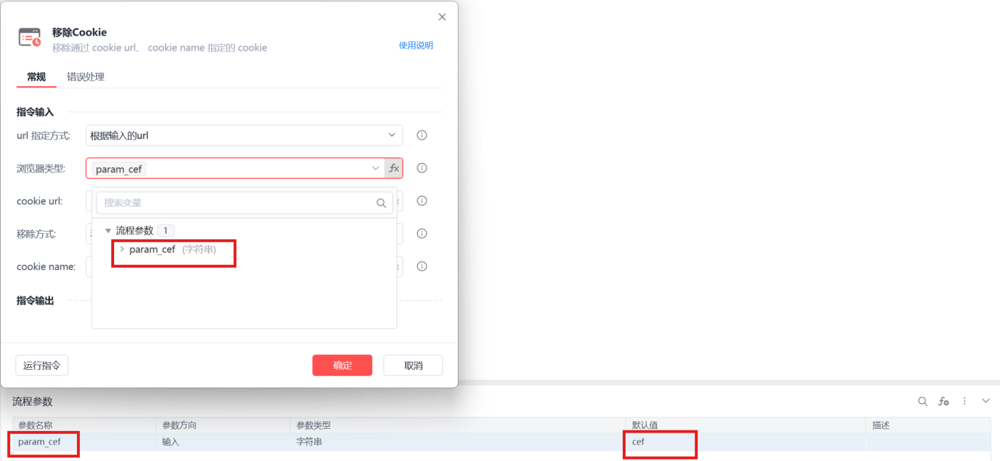
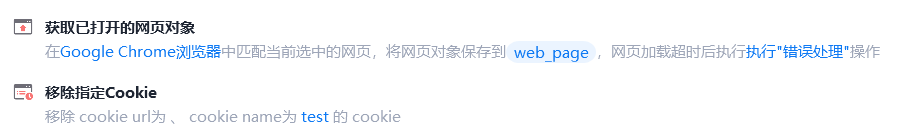

# 移除指定Cookie

移除指定Cookie
💡

移除通过 cookie url、cookie name指定的cookie

url 指定方式：

根据网页对象：选择一个之前通过【打开网页】或【获取已打开的网页对象】指令创建的网页对象

根据输入的url：选择浏览器类型，设置与 cookie 相关联的 url值

浏览器类型支持fx变量：

浏览器类型

	

变量值

影刀浏览器

	

cef

Google Chrome浏览器

	

chrome

Microsoft Edge浏览器

	

edge

Internet Explorer浏览器

	

ie

360浏览器

	

360se

Firefox

	

firefox

QQ浏览器(自定义)

	

QQBrowser

例如：

cookie name

输入或选择cookie name, 可为空

使用示例

此流程执行逻辑：【获取已打开的网页对象】 --> 使用【移除指定Cookie】指令移除指定cookie

备注：移除的是当前网页对象中的cookie name，若当前网页对象cookie中不包含该cookie name，则移除不生效

## 参数截图

