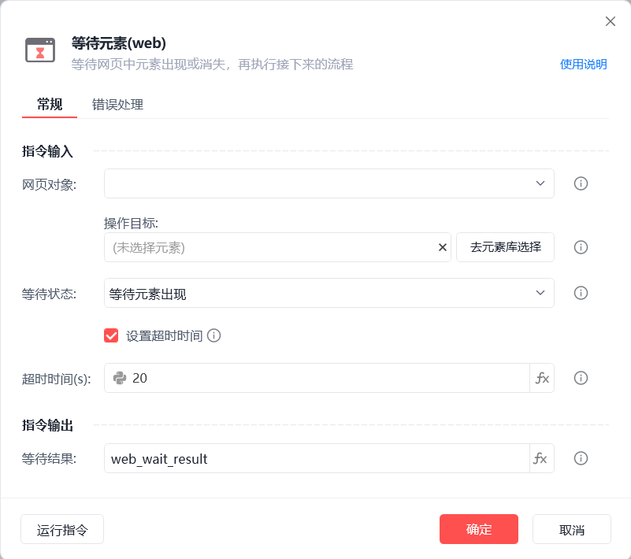
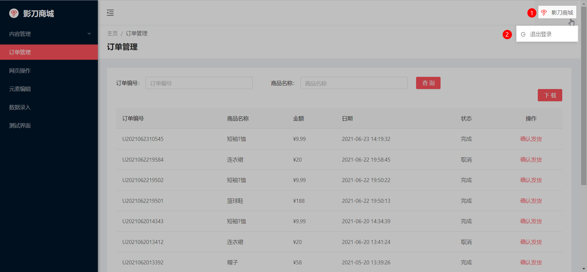

# 等待元素(web)

等待元素(web)
💡

等待网页元素出现或消失，再执行接下来的流程

🎬 视频课程：影刀RPA中级课程： 网页自动化-进阶

网页对象

选择一个之前通过【打开网页】或【获取已打开的网页对象】指令创建的网页对象

操作目标

从「元素库」中选择一个已捕获的元素或通过「捕获新元素」来捕获新的网页元素作为操作目标

等待状态

等待元素出现/消失

设置超时时间

设置超时时间，超时后流程将自动往下继续执行，单位为秒

等待结果

在超时时间内，等待状态符合则返回值为True,否则返回值为False

使用示例

此流程执行逻辑：【获取已打开的网页对象】 --> 鼠标悬停在指定元素上 --> 使用【等待元素(web)】指令等待"退出登录"按钮出现，最多等待20秒 --> 若在超时时间内出现则执行【点击元素(web)】指令

## 参数截图

