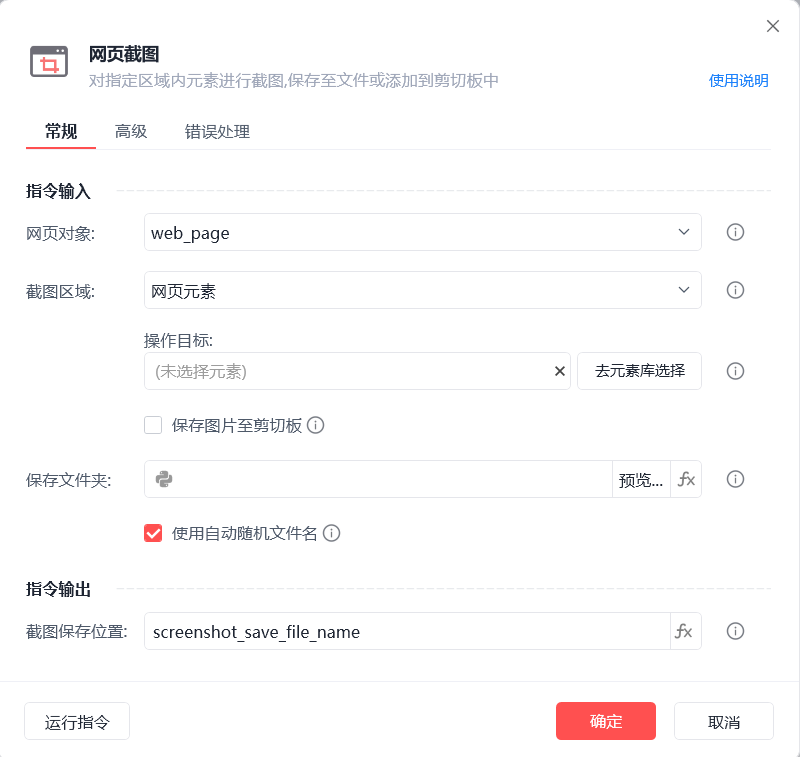

# 网页截图

网页截图
💡

对指定区域内元素进行截图，保存至文件或添加到剪切板中

网页对象

选择一个之前通过【打开网页】或【获取已打开的网页对象】指令创建的网页对象

截图区域

网页元素：通过指定操作目标的显示内容进行截图

网页可见区域：截取当前浏览器中可视区域的内容

整个网页：整个网页有滚动条的情况，会截图滚动条长度内的所有内容

保存图片至剪切板

将截图保存至剪切板，支持后续流程通过CTRL+V操作将图片进行粘贴

保存文件夹

设置图片的保存文件夹路径

使用自动随机文件名

为截图自动生成不重复的文件名（以时间戳命名）

截图保存位置

截图文件路径信息

等待元素存在(s)

等待目标元素存在的超时时间

使用示例

此流程执行逻辑：打开影刀官网 --> 使用【网页截图】指令对网页可视区域进行截图，并将结果保存至本地并保存路径

## 参数截图

