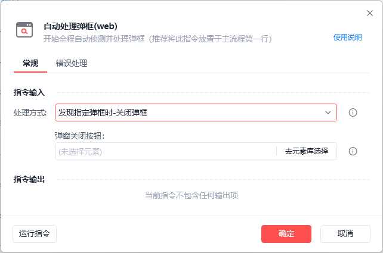
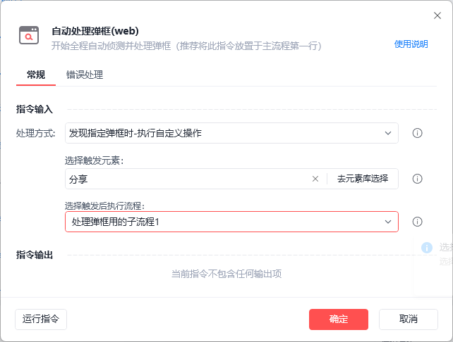
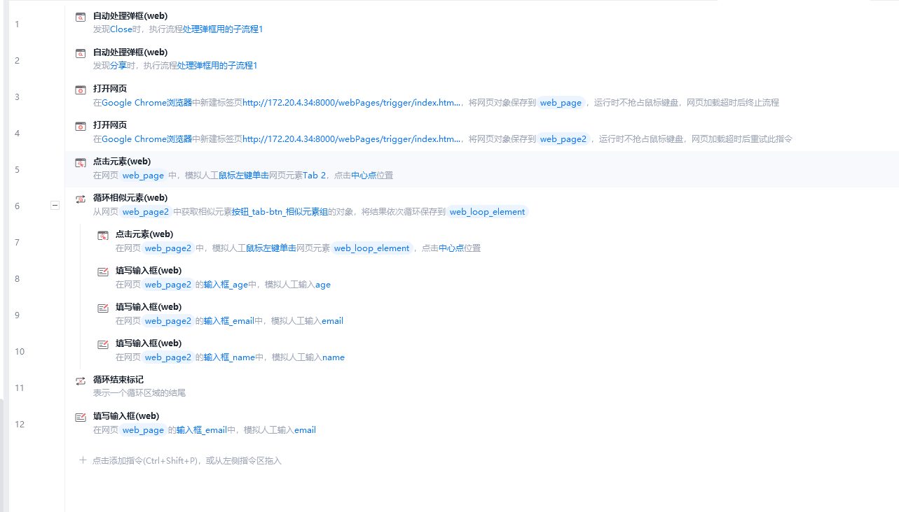

# 自动处理弹框(web)

自动处理弹框(web)
指令背景

在进行网页自动化的过程中，某些网站会随机弹出一些广告推广弹窗，影响正常自动化流程的稳定性与健壮性。

指令介绍

调用此指令后，在操作目标网页时（如点击元素、填写输入框等），若此指令设置的条件满足，会先去执行设置好的操作，然后再去执行原本的操作。

注意：本指令仅对当前指令之后的打开网页、获取已打开网页生效，对在此指令调用之前已经打开的网页不生效。

参数解释
处理方式：发现指定弹框时-关闭弹框

选择此处理方式时，需指定广告弹框的关闭按钮。

当对目标网页进行网页操作时，若弹窗关闭按钮存在，则会自动点击弹框按钮。

处理方式：发现指定弹框时-执行自定义操作

选择此处理方式时，需指定触发元素与子流程。

当对目标网页进行网页操作时，若触发元素存在，则会执行指定的子流程。

在执行子流程之前，会将目标网页激活，在子流程内部可以通过【获取已打开的网页对象】指令来获取当前出现弹框的网页，而后进行自定义操作，如验证码处理等。

指令限制
限制一

仅对当前指令之后的打开网页、获取已打开网页生效，对在此指令调用之前已经打开的网页不生效。

限制二

当以下指令操作【限制一中生效的网页】时，且目标网页设置的条件满足时，才会执行指定的操作。

指令列表：

点击元素(web)

鼠标悬停在元素上(web)

填写输入框(web)

填写密码框(web)

拖拽元素(web)

批量数据抓取(web)

网页截图(web)

下载文件(web)

上传文件(web)

限制三

弹窗关闭按钮 与 触发元素 不支持跨域元素（即元素的节点中包含 iframe 与 frame 节点）

使用示例

第一行：通过本指令注册自动处理弹框

第三行：通过打开网页打开一个会随机弹框的网页，因此网页在 自动处理弹框 (web) 之后被打开，所以此网页有自动处理弹框的能力

第六行及之后：循环操作目标网页，当执行任一点击元素、填写输入框指令时，若弹框出现，则会优先关闭弹框，而后进行元素操作

## 参数截图

