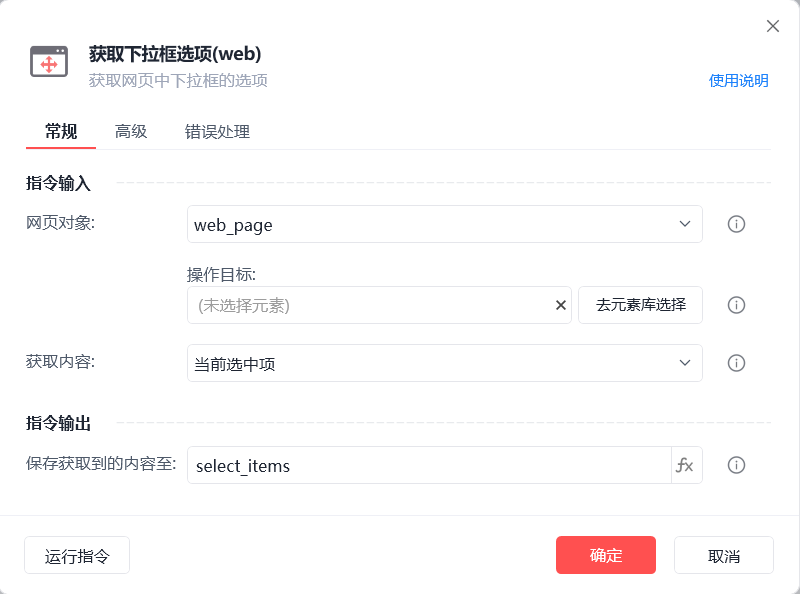
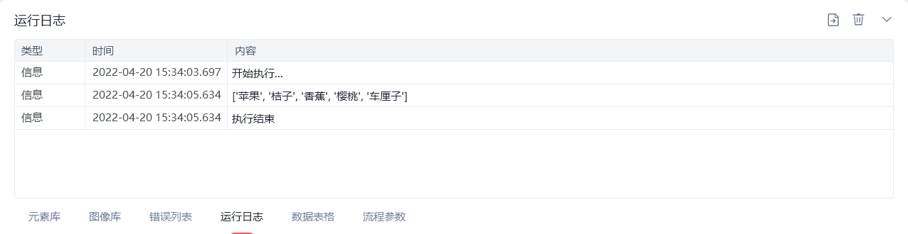

# 获取下拉框选项(web)

获取下拉框选项(web)
💡

获取网页中下拉框的选项

🎬 视频课程：影刀RPA中级课程： 网页自动化-进阶

网页对象

选择一个之前通过【打开网页】或【获取已打开的网页对象】指令创建的网页对象

操作目标

从「元素库」中选择一个已捕获的元素或通过「捕获新元素」来捕获新的网页元素作为操作目标

获取内容

当前选中项/全部下拉项

保存获取到的内容至

保存获取到的下拉项内容为变量，变量类型为一维列表

等待元素存在(s)

等待目标元素存在的超时时间

使用示例

此流程执行逻辑：打开影刀商城网页 --> 使用【获取下拉框选项(web)】指令获取指定下拉框的全部下拉项并保存结果 --> 执行【打印日志】指令打印保存结果

## 参数截图

