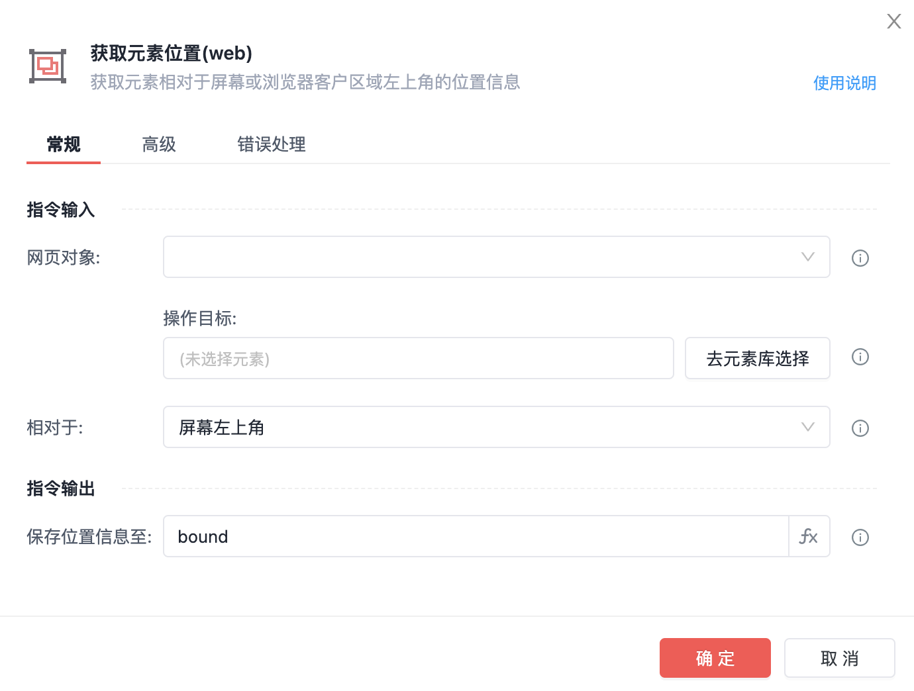
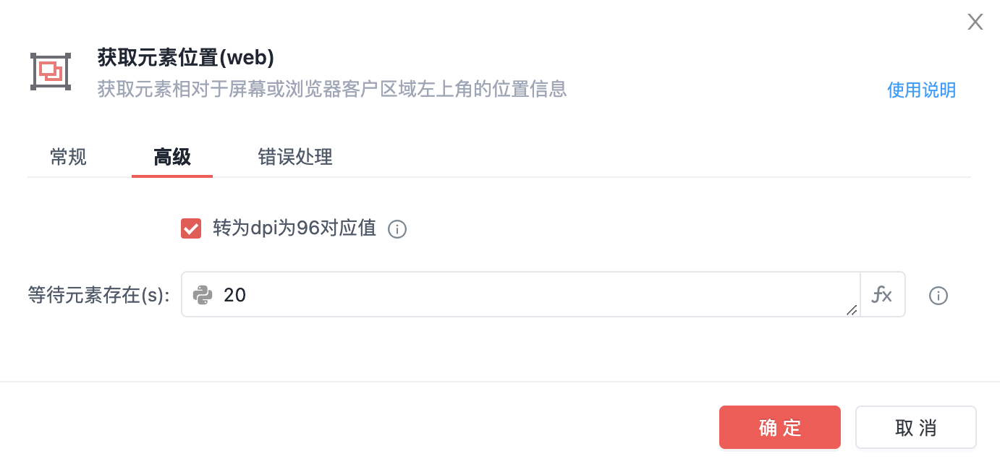
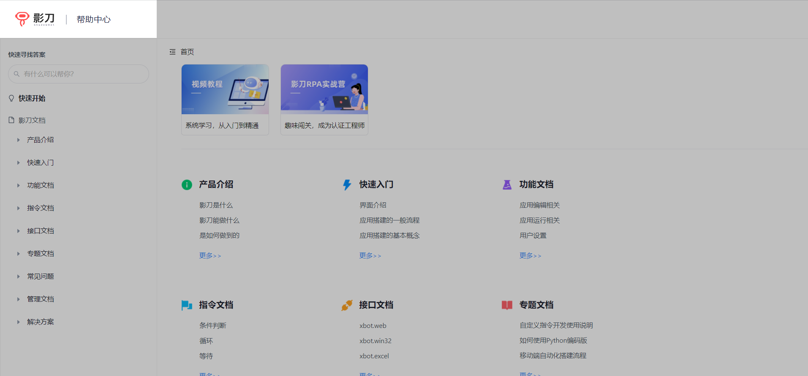
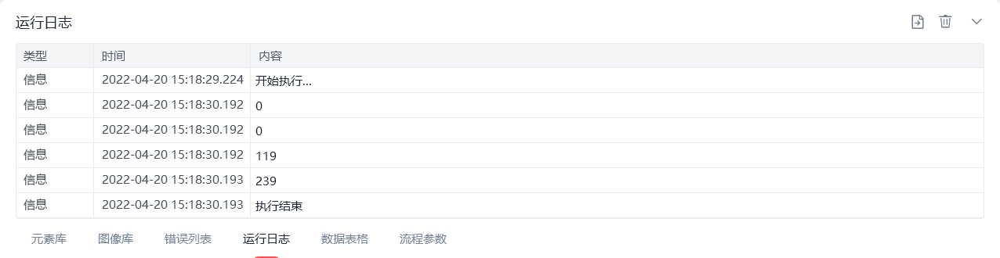

# 获取元素位置(web)

获取元素位置(web)

🎬 视频课程：影刀RPA中级课程： 网页自动化-进阶

网页对象

选择一个之前通过【打开网页】或【获取已打开的网页对象】指令创建的网页对象

操作目标

从「元素库」中选择一个已捕获的元素或通过「捕获新元素」来捕获新的网页元素作为操作目标

相对于

屏幕左上角/浏览器页面左上角

保存位置信息至

保存获取到的元素位置为变量

注：元素位置信息包含左边距、右边距、顶部边距、底部边距、中心点横坐标、中心点纵坐标、元素宽度、元素高度

转为dpi为96对应值

将位置数值转换成设备缩放率为100%的数值，即每个单位1/96英寸

等待元素存在(s)

等待目标元素存在的超时时间

使用示例

此流程执行逻辑：打开影刀帮助中心网页 --> 使用【获取元素位置(web)】指令获取指定元素相对于浏览器页面左上角的位置信息并保存 --> 执行【打印日志】指令打印指定元素相对于浏览器页面左上角的左边距、上边距、中心点横坐标、元素宽度

## 参数截图

