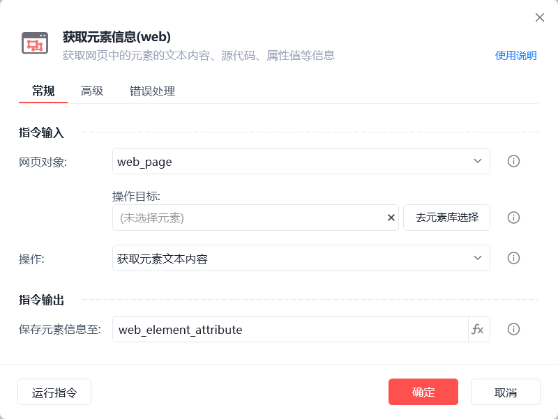
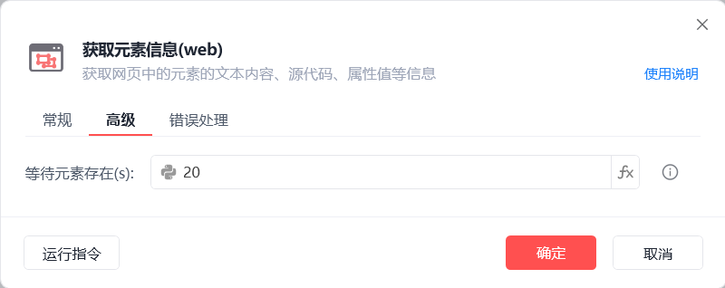
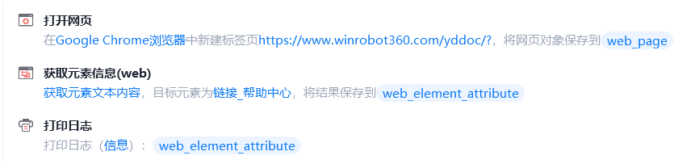
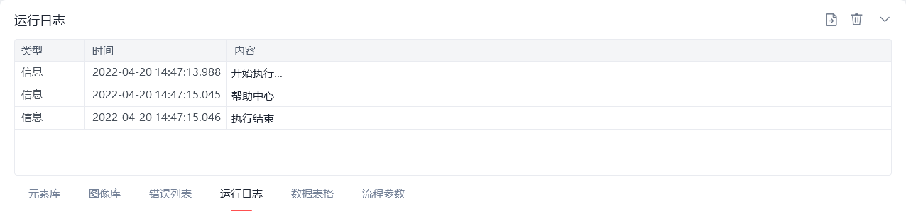

# 获取元素信息(web)

获取元素信息(web)
💡

获取网页中元素的文本内容、源代码、属性值等信息

🎬 视频课程：影刀RPA中级课程： 网页自动化-进阶

🎬 视频课程：数据获取

操作

网页对象

选择一个之前通过【打开网页】或【获取已打开的网页对象】指令创建的网页对象

操作目标

从「元素库」中选择一个已捕获的元素或通过「捕获新元素」来捕获新的网页元素作为操作目标

操作

获取元素文本内容：获取可见的文本内容

获取元素源代码：元素对应的网页源代码

获取元素值：获取数值

获取网页链接地址：获取超链接元素、图片元素等链接地址

智能识别并补充地址前缀(http:// 或 https://)：若无法获取链接地址或需补充地址前缀，可勾选此选项

获取元素属性：可获取href(跳转链接)、src(图片链接)、class(类型)等属性

获取元素位置：

保存元素信息至

保存获取到的操作结果为变量

等待元素存在(s)

等待目标元素存在的超时时间

使用示例

此流程执行逻辑：打开影刀帮助中心网页 --> 使用【获取元素信息(web)】指令获取指定元素的文本内容并保存操作结果 --> 执行【打印日志】指令打印操作结果

## 参数截图

