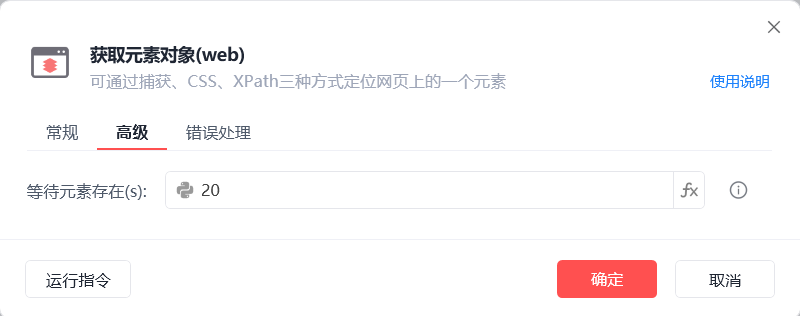
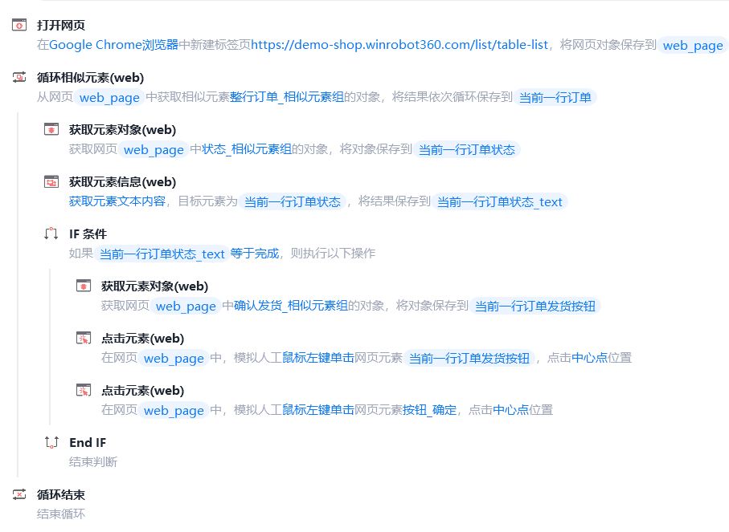
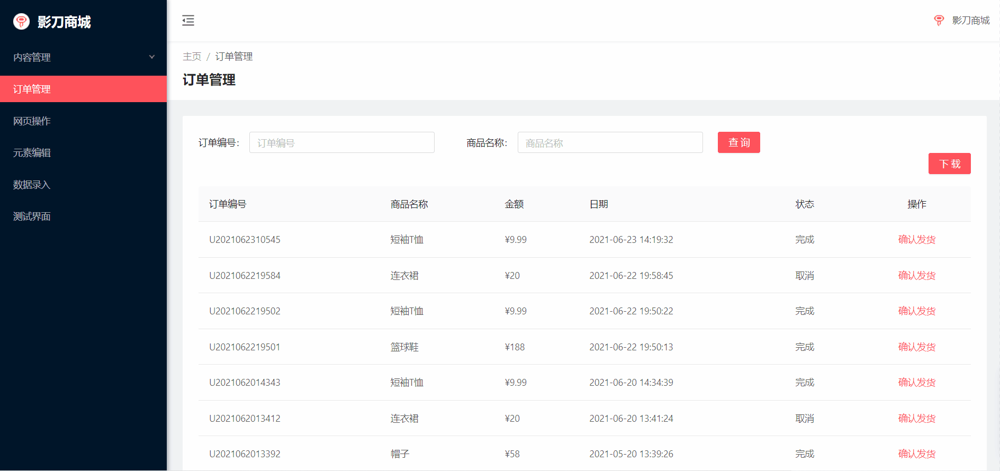
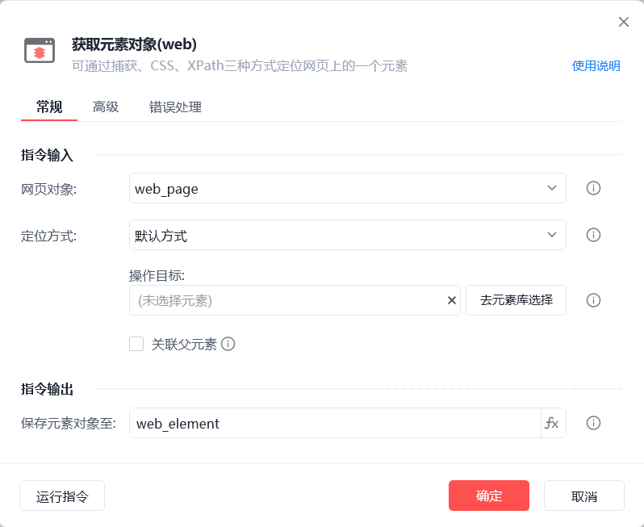

# 获取元素对象(web)

获取元素对象(web)
💡

可通过捕获元素、CSS、XPath三种方式定位网页上的一个元素

🎬 视频课程：影刀RPA中级课程： 网页自动化-进阶

网页对象

选择一个之前通过【打开网页】或【获取已打开的网页对象】指令创建的网页对象

定位方式

默认方式，即捕获元素

CSS选择器

XPath选择器使用说明

关联父元素

在指定父元素中获取元素对象

保存元素对象至

保存获取到的元素对象为变量

等待元素存在(s)

等待目标元素存在的超时时间

使用示例

此流程执行逻辑：打开影刀商城网页 --> 使用【循环相似元素(web)】指令循环每行订单 --> 使用【获取元素对象(web)】指令获取当前一行订单的状态 --> 判断状态文本内容是否为完成 --> 若为完成则执行【获取元素对象(web)】指令获取当前一行发货按钮并点击 --> 直至循环结束

常见问题

网页中通过关联父元素找子元素

## 参数截图

