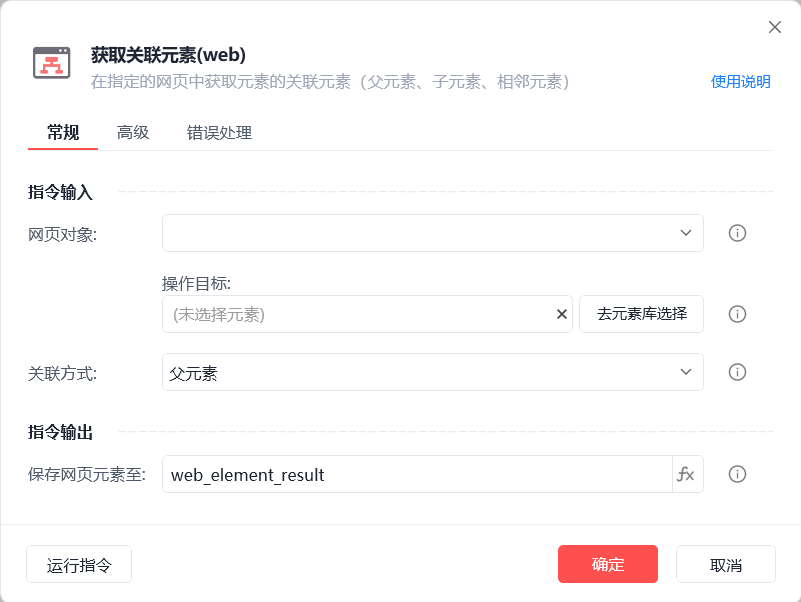
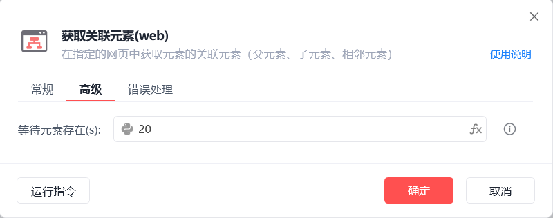
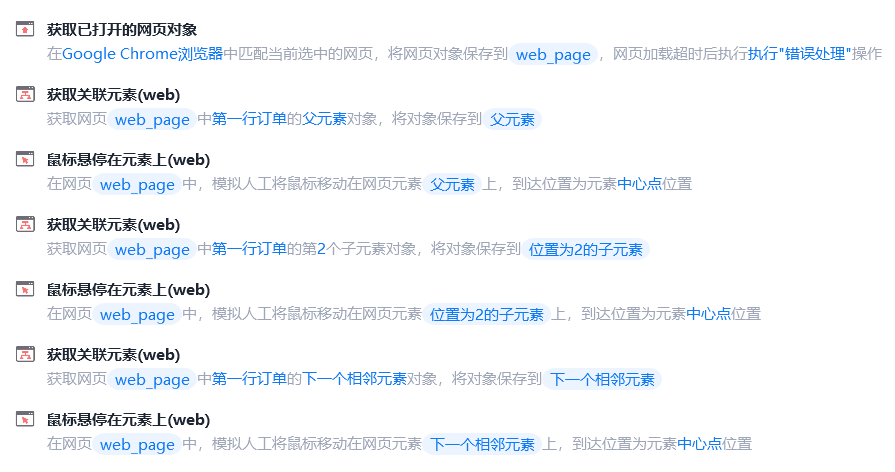
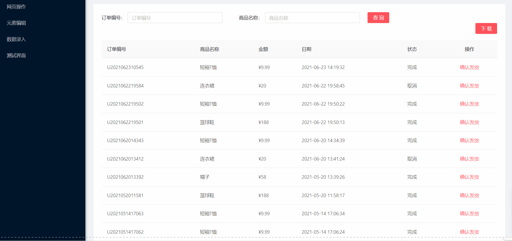

# 获取关联元素(web)

获取关联元素(web)
💡

通过捕获到的元素获取它的关联元素(父元素、子元素、相邻元素)

🎬 视频课程：影刀RPA中级课程： 网页自动化-进阶

网页对象

选择一个之前通过【打开网页】或【获取已打开的网页对象】指令创建的网页对象

操作目标

从「元素库」中选择一个已捕获的元素或通过「捕获新元素」来捕获新的网页元素作为操作目标

关联方式

父元素：关联网页中上一级元素

子元素：关联所有子元素或指定位置的子元素

相邻元素：关联网页中同级的上/下一个相邻元素

保存网页元素至

保存获取到的关联元素为变量

等待元素存在(s)

等待目标元素存在的超时时间

注：【获取关联元素(web)】主要是用于少数无法直接捕获到的网页元素，可通过捕获其父元素、子元素、相邻元素关联获取

使用示例

此流程执行逻辑：获取已打开的影刀商城网页 --> 捕获第一行订单元素 --> 使用【获取关联元素(web)】指令获取其父元素并使用【鼠标悬停在元素上(web)】指令将鼠标移动至中心点位置 --> 同理,将鼠标移动至获取到的关联元素的中心点位置

## 参数截图

