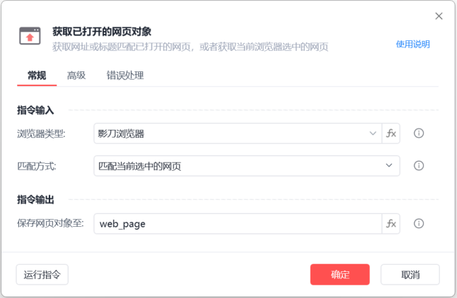
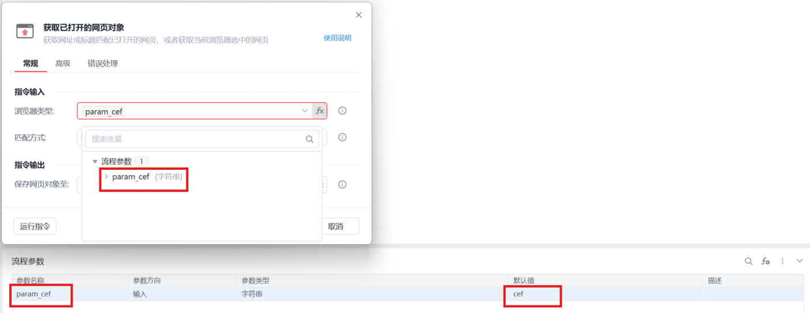
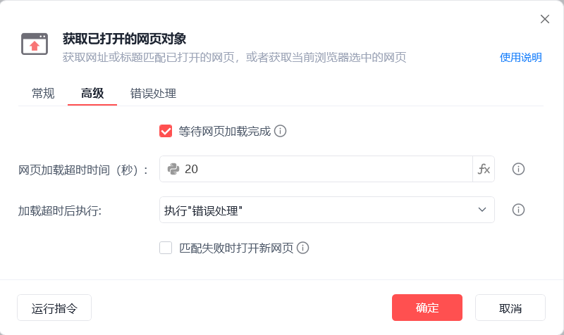
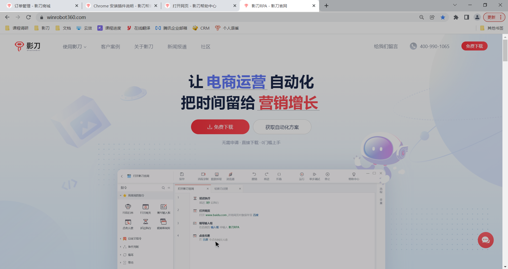
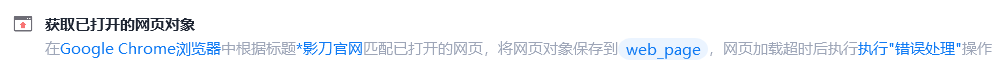

# 获取已打开的网页对象

获取已打开的网页对象
💡

获取网址或者标题匹配已打开的网页，或者获取当前浏览器选中的网页

🎬 视频课程：影刀RPA中级课程： 网页自动化-进阶

浏览器类型

影刀浏览器，支持静默运行

Chrome，Edge，360浏览器，支持运行时不抢占鼠标键盘

Google Chrome浏览器,插件安装说明

Microsoft Edge浏览器插件安装说明

Internet Explorer浏览器

360浏览器插件安装说明

Firefox浏览器插件安装说明

浏览器类型支持fx变量：

浏览器类型

	

变量值

影刀浏览器

	

cef

Google Chrome浏览器

	

chrome

Microsoft Edge浏览器

	

edge

Internet Explorer浏览器

	

ie

360浏览器

	

360se

Firefox

	

firefox

QQ浏览器(自定义)

	

QQBrowser

例如：

匹配方式

根据标题匹配：需设置标题内容

根据网址匹配：需设置指定网址

匹配当前选中的页面

保存网页对象至

保存网页对象至变量，后续流程用到该网页时，可直接调用该变量

等待网页加载完成

设置网页加载超时时间，加载超时后执行「错误处理」或停止网页加载，单位为秒

匹配失败时打开新页面

设置匹配失败时打开的新网址

使用示例

此流程执行逻辑：使用【获取已打开的网页对象】根据标题"*影刀官网"通配符匹配指定网页并保存网页对象

注："*影刀官网"的含义代表任意以"影刀官网"为结尾的网页标题

## 参数截图

