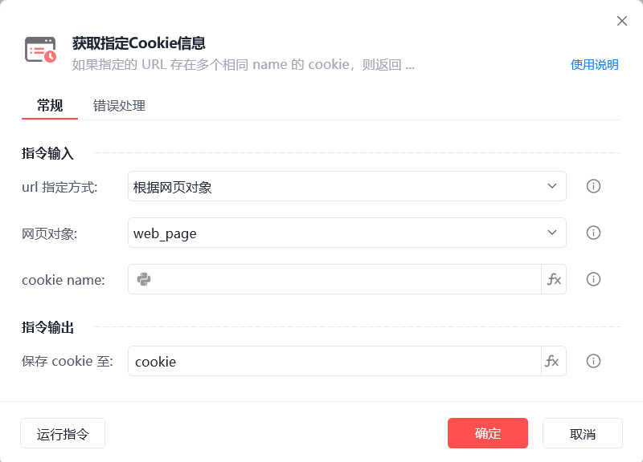
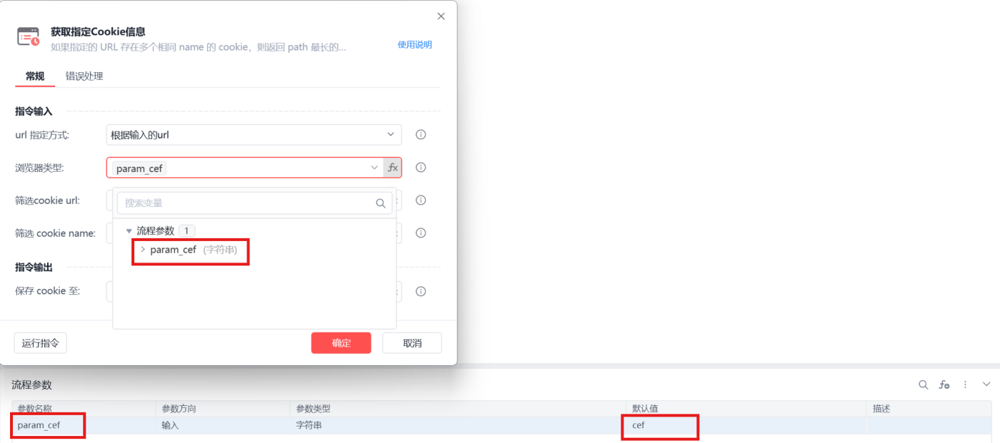
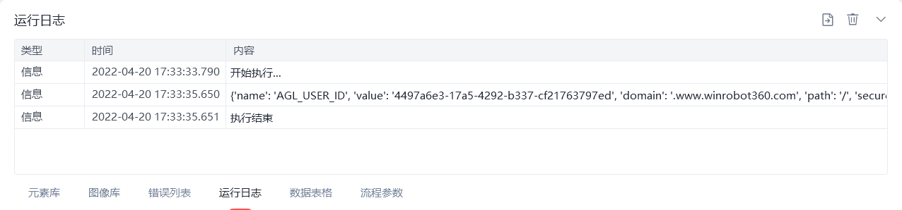

# 获取指定Cookie信息

获取指定Cookie信息
💡

如果指定的URL存在多个相同 name 的 cookie，则返回 path 最长的 cookie。若 path 长度相同，返会创建时间较早的 cookie

url指定方式

根据网页对象：自动使用指定网页url进行筛选

根据输入的url：选择浏览器类型并手动输入cookie url

浏览器类型支持fx变量：

浏览器类型

	

变量值

影刀浏览器

	

cef

Google Chrome浏览器

	

chrome

Microsoft Edge浏览器

	

edge

Internet Explorer浏览器

	

ie

360浏览器

	

360se

Firefox

	

firefox

QQ浏览器(自定义)

	

QQBrowser

例如：

cookie name

根据是否与给定的"name"匹配来筛选cookie

保存cookie至

保存获取到的cookie为变量，变量类型为字典

使用示例

此流程执行逻辑：打开影刀官网 --> 使用【获取指定Cookie信息】指令根据网页对象url和指定的cookie name获取特定cookie信息并保存结果--> 执行【打印日志】打印保存结果

## 参数截图

