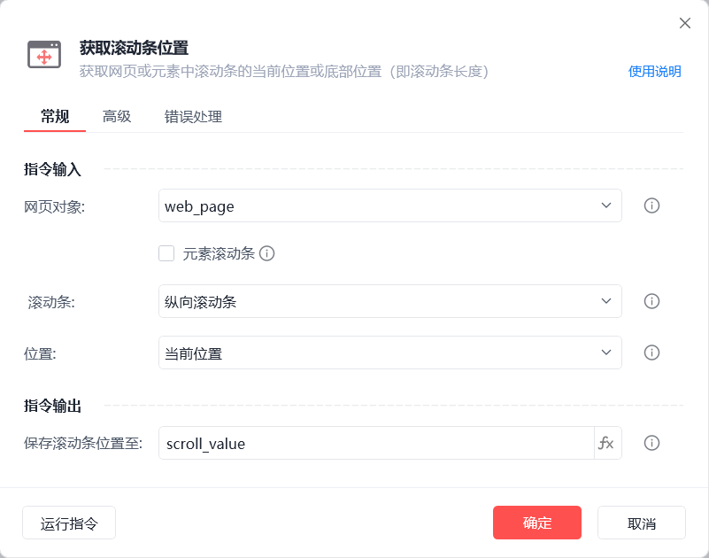
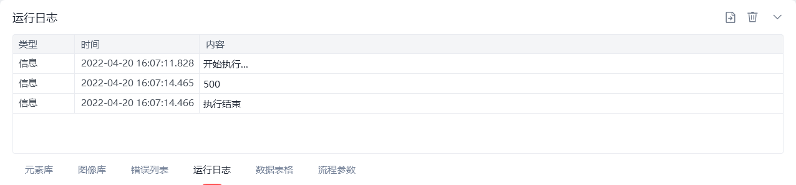

# 获取滚动条位置

获取滚动条位置
💡

获取网页或元素中滚动条的当前位置或底部位置（即滚动条长度）

🎬 视频课程：影刀RPA中级课程： 网页自动化-进阶

网页对象

选择一个之前通过【打开网页】或【获取已打开的网页对象】指令创建的网页对象

元素滚动条

获取指定元素滚动条的位置，若当前操作元素无滚动条，支持自动向上查找滚动条元素

滚动条

纵向/横向滚动条

位置

当前位置：滚动条当前位置距离滚动条顶部的距离

底部位置：滚动条的底部位置，即滚动条的长度

保存滚动条位置至

保存获取到的滚动条位置为变量

等待元素存在(s)

等待目标元素存在的超时时间

使用示例

此流程执行逻辑：打开影刀官网 --> 执行【鼠标滚动网页】滚动到(0,500) --> 使用【获取滚动条位置】指令获取元素纵向滚动条的当前位置并保存结果 --> 执行【打印日志】指令打印保存结果

## 参数截图

