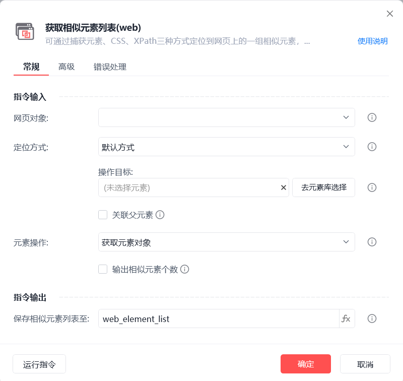
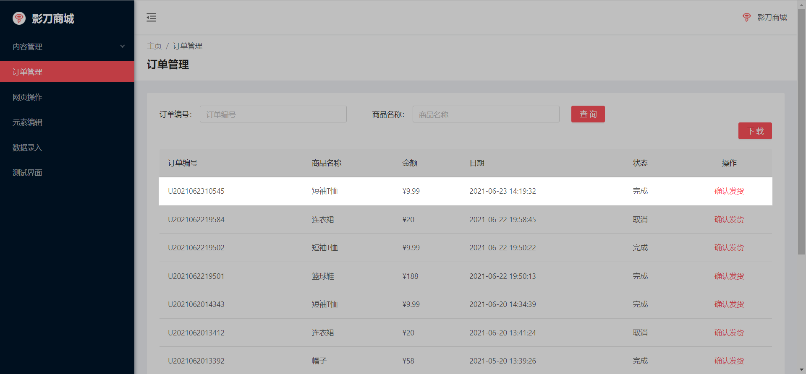
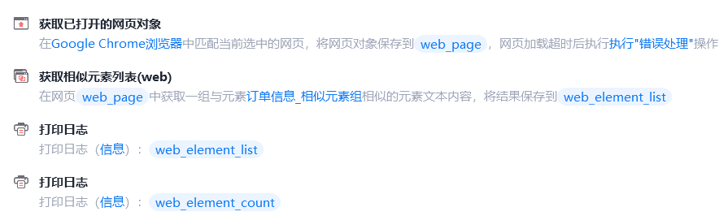
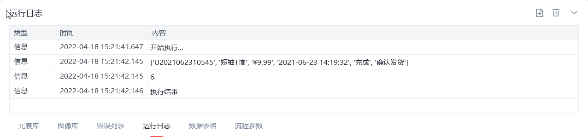

# 获取相似元素列表(web)

获取相似元素列表(web)
💡

可通过捕获元素、CSS、XPath三种方式定位到网页上的一组相似元素，获取对象或文本等信息

🎬 视频课程：影刀RPA中级课程： 网页自动化-进阶

网页对象

选择一个之前通过【打开网页】或【获取已打开的网页对象】指令创建的网页对象

定位方式

默认方式，即捕获元素

CSS选择器

XPath选择器使用说明

关联父元素

在指定父元素中获取相似元素组

元素操作

获取元素对象：对象本身，可执行点击、悬停等操作

获取元素文本内容：获取可见的文本内容

获取元素值：获取数值

获取元素链接地址：可获取图片链接地址等

获取元素源代码：元素对应的网页源代码

获取元素属性：可获取href(跳转链接)、src(图片链接)、class(类型)等属性

输出相似元素个数

勾选后输出指定相似元素列表的列表项个数

保存相似元素列表至

保存获取到的相似元素列表为变量

使用示例

此流程执行逻辑：【获取已打开的网页对象】 --> 使用【获取相似元素列表(web)】指令获取指定相似元素组的文本内容及相似元素个数 --> 执行【打印日志】指令打印文本内容及个数

## 参数截图

