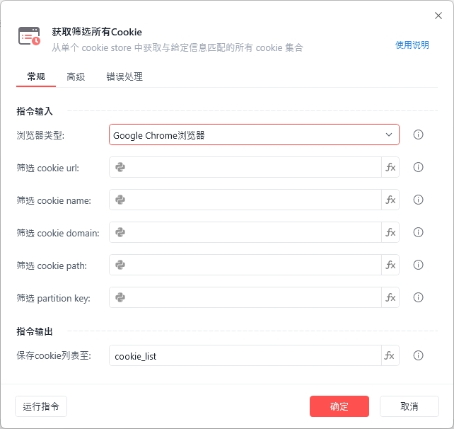
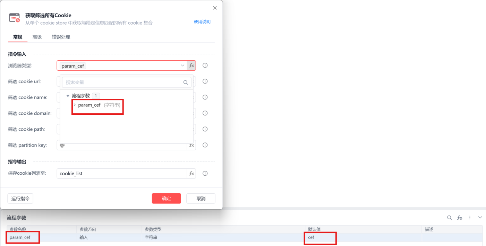
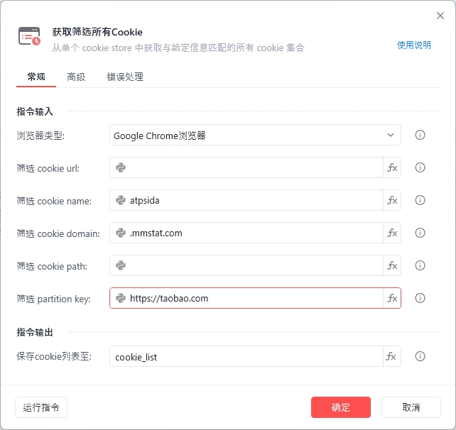
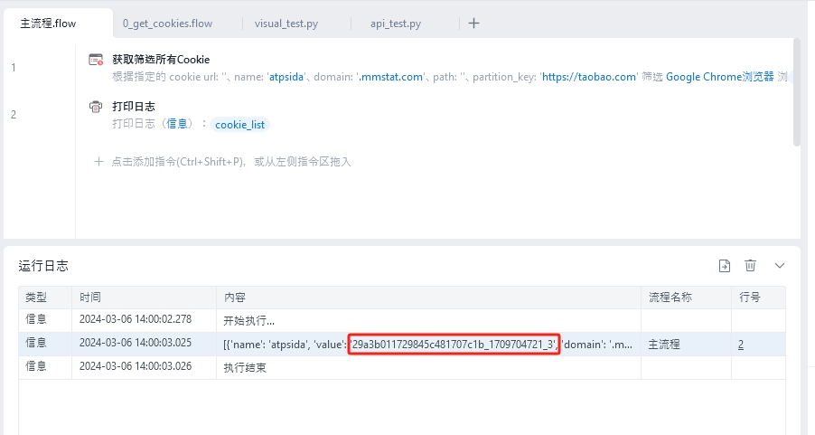
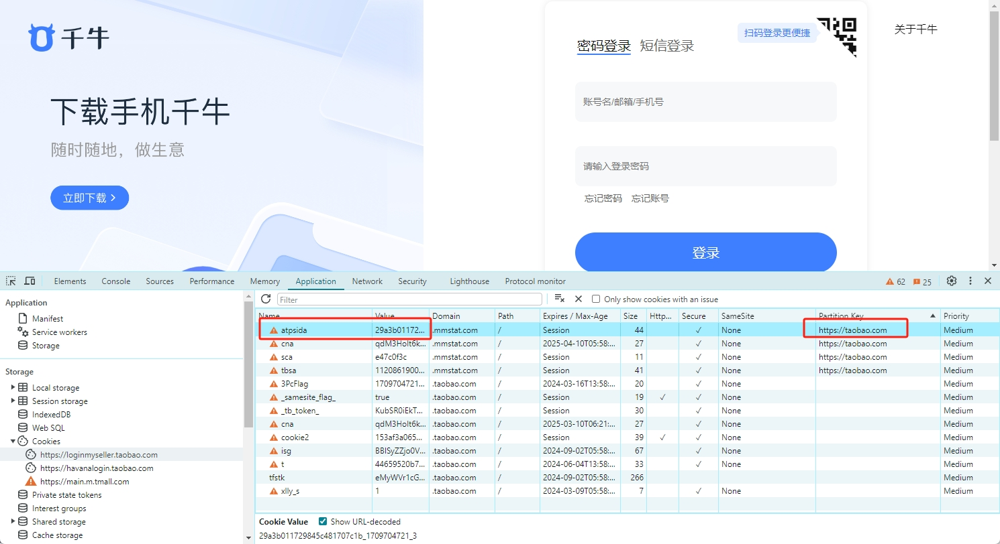
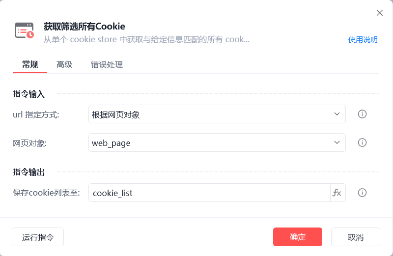
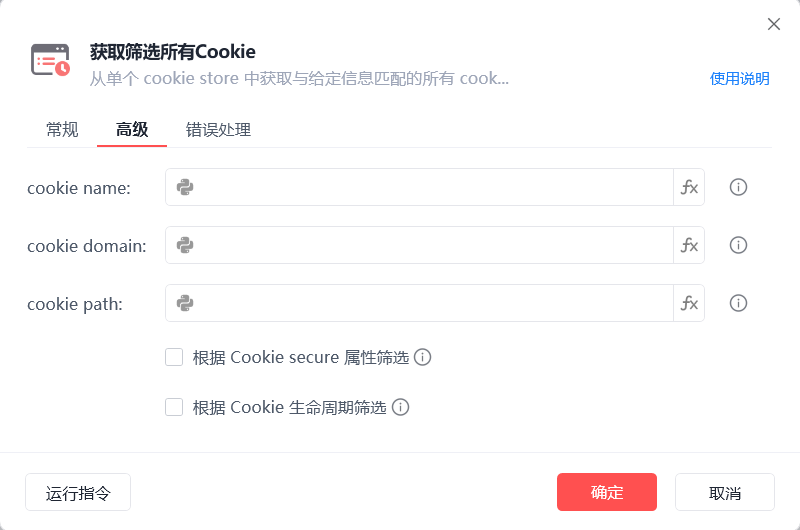
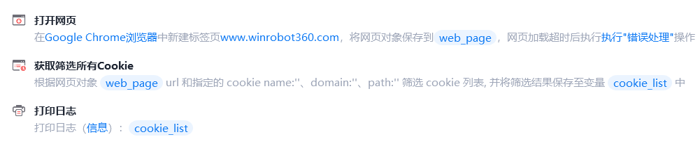
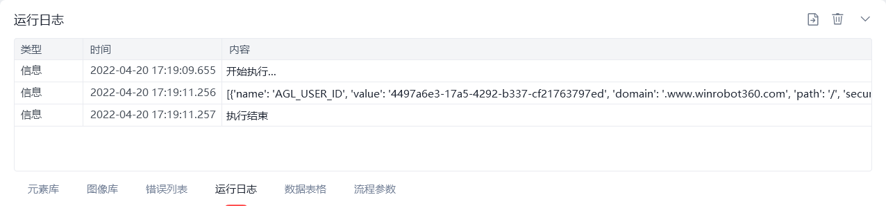

# 获取筛选所有Cookie

获取筛选所有Cookie
💡

从单个cookie store中获取与给定信息匹配的所有cookie集合

获取筛选所有Cookie V2 版本

注：影刀 5.16 版本及之后的新编辑的获取筛选所有Cookie指令为 V2 版本，该版本支持筛选具有 PartitionKey 属性的 Cookie，且取消强制填写 URL 筛选条件。

参数解释

筛选 cookie url

根据是否与给定的"url"匹配来筛选cookie，除 IE 浏览器外都可为空

浏览器类型支持fx变量：

浏览器类型

	

变量值

影刀浏览器

	

cef

Google Chrome浏览器

	

chrome

Microsoft Edge浏览器

	

edge

Internet Explorer浏览器

	

ie

360浏览器

	

360se

Firefox

	

firefox

QQ浏览器(自定义)

	

QQBrowser

例如：

筛选 cookie name

根据是否与给定的"name"匹配来筛选cookie，可为空

筛选 cookie domain

根据是否完全与给定的"domain"匹配，如：".yingdao.com"，或是否是其子域名来筛选cookie，值为空则忽略

筛选 cookie partition key

根据是否与给定的 PartitionKey 匹配，值为空则忽略

若cookie包含 PartitionKey，则必须通过PartitionKey才可以获取到

注意：仅当浏览器类型为 Chrome、Edge、360、Firefox 和自定义浏览器时才显示此配置项，且 Chrome/Edge 版本必须大于 119，Firefox 大于 94 才可使用该筛选条件，在低版本上运行则报错。

筛选 cookie path

根据是否与给定的path匹配，如：'/' 来筛选cookie，值为空则忽略

根据Cookie secure属性筛选

筛选secure=true cookie 或 secure=false cookie

根据Cookie生命周期筛选

筛选会话cookie 或 永久性cookie

保存cookie列表至

保存获取到的cookie列表为变量

注：保存的cookie列表中列表项包括"domain"、"expirationDate"、"name"、"value"、"httpOnly"等

使用示例

此流程执行逻辑：使用【获取筛选所有Cookie】指令在 Chrome 浏览器中通过 name: atpsida，domain：.mmstat.com，PartitionKey：https://taobao.com 筛选cookie --> 执行【打印日志】打印筛选结果

获取筛选所有Cookie V1 版本

注：影刀 5.16 版本之前的获取筛选所有Cookie指令为V1版本，该版本不支持筛选具有 PartitionKey 属性的 Cookie，且必须填写 URL 属性来筛选 Cookie。V1版本在影刀升级至5.16及以后不影响运行及编辑。

参数解释

url指定方式

根据网页对象：自动使用指定网页url进行筛选

根据输入的url：选择浏览器类型并手动输入cookie url

保存cookie列表至

保存获取到的cookie列表为变量

注：保存的cookie列表中列表项包括"domain"、"expirationDate"、"name"、"value"、"httpOnly"等

cookie name

根据是否与给定的"name"匹配来筛选cookie，可为空

cookie domain

根据是否完全与给定的"domain"匹配，如：".yingdao.com"，或是否是其子域名来筛选cookie，浏览器类型为IE或值为空则忽略

cookie path

根据是否与给定的path匹配，如：'/'来筛选cookie，浏览器类型为IE或值为空则忽略

根据Cookie secure属性筛选

筛选secure=true cookie 或 secure=false cookie

根据Cookie生命周期筛选

筛选会话cookie 或 永久性cookie

使用示例

此流程执行逻辑：打开影刀官网 --> 使用【获取筛选所有Cookie】指令根据网页对象url进行筛选并保存筛选结果--> 执行【打印日志】打印筛选结果

## 参数截图

