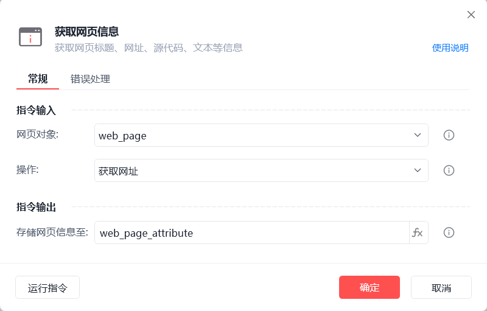
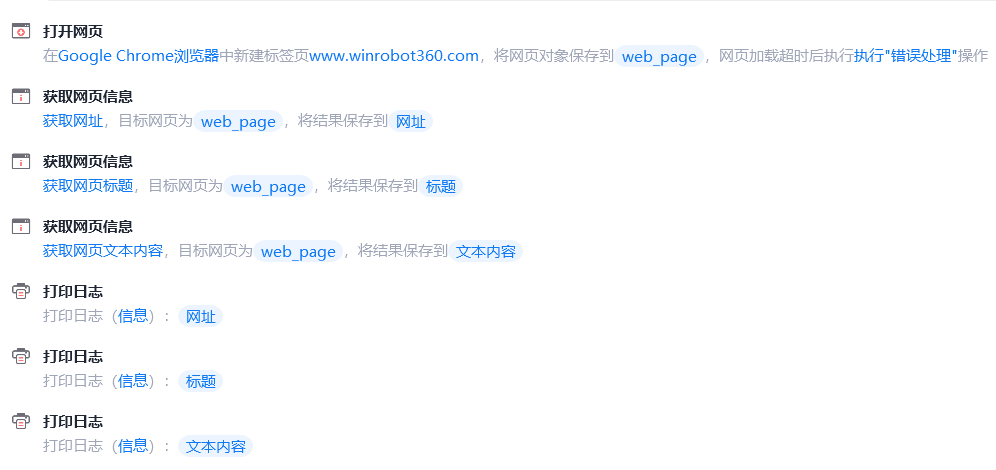
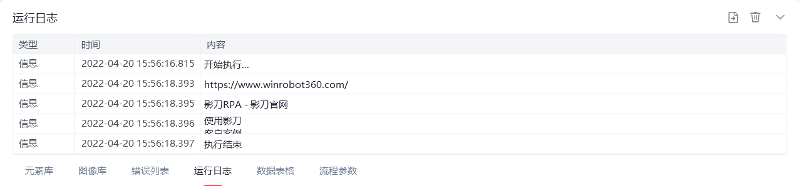

# 获取网页信息

获取网页信息
💡

获取网页标题、网址、源代码、文本等信息

🎬 视频课程：影刀RPA中级课程： 网页自动化-进阶

网页对象

选择一个之前通过【打开网页】或【获取已打开的网页对象】指令创建的网页对象

操作

获取网址/标题/源代码/文本内容

存储网页信息至

保存获取到的网页信息为变量

使用示例

此流程执行逻辑：打开影刀官网 --> 使用【获取网页信息】指令获取网址、标题、文本内容并保存结果 --> 执行【打印日志】打印保存结果

## 参数截图

