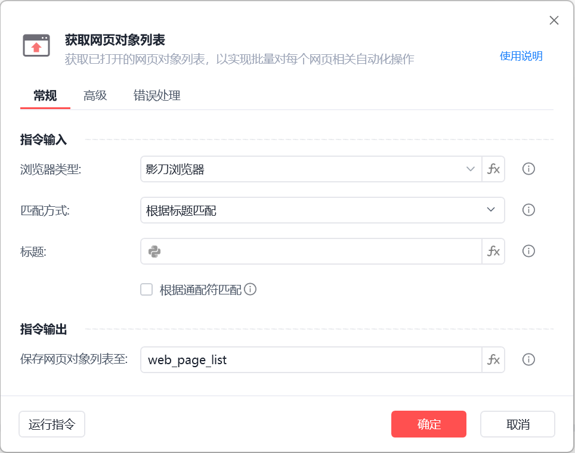
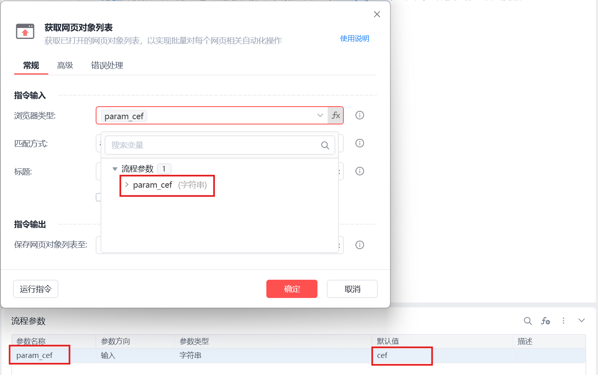
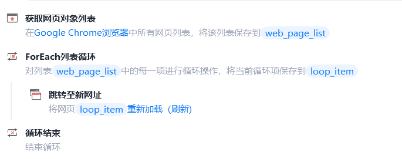

# 获取网页对象列表

获取网页对象列表
💡

获取已打开的网页对象列表，以实现批量对每个网页进行自动化操作

浏览器类型

影刀浏览器，支持静默运行

Google Chrome浏览器,插件安装说明

Microsoft Edge浏览器插件安装说明

Internet Explorer浏览器

360浏览器插件安装说明

Firefox浏览器插件安装说明

浏览器类型支持fx变量：

浏览器类型

	

变量值

影刀浏览器

	

cef

Google Chrome浏览器

	

chrome

Microsoft Edge浏览器

	

edge

Internet Explorer浏览器

	

ie

360浏览器

	

360se

Firefox

	

firefox

QQ浏览器(自定义)

	

QQBrowser

例如：

匹配方式

匹配所有网页：指定浏览器上已打开的所有网页

根据标题匹配：指定浏览器上已打开的标题匹配的网页，支持通配符匹配

根据网址匹配：指定浏览器上已打开的网址匹配的网页，支持通配符匹配

保存网页对象列表至

保存获取到的网页对象列表为变量

使用示例

此流程执行逻辑：使用【获取网页对象列表】指令获取指定浏览器上已打开的所有网页并保存网页对象列表 --> 执行【ForEach列表循环】循环列表 --> 循环体执行【跳转至新网址】指令重新加载每一个网页

## 参数截图

