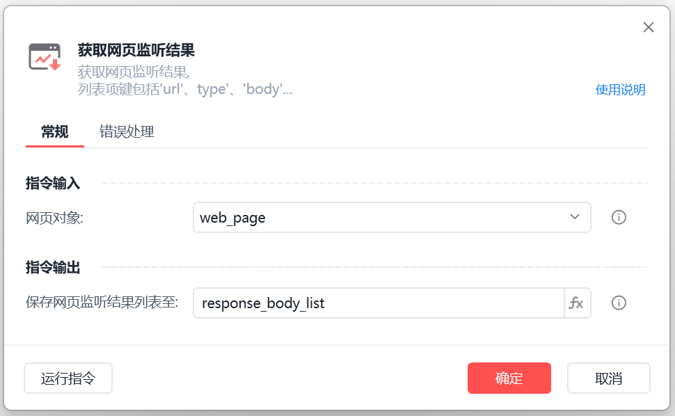
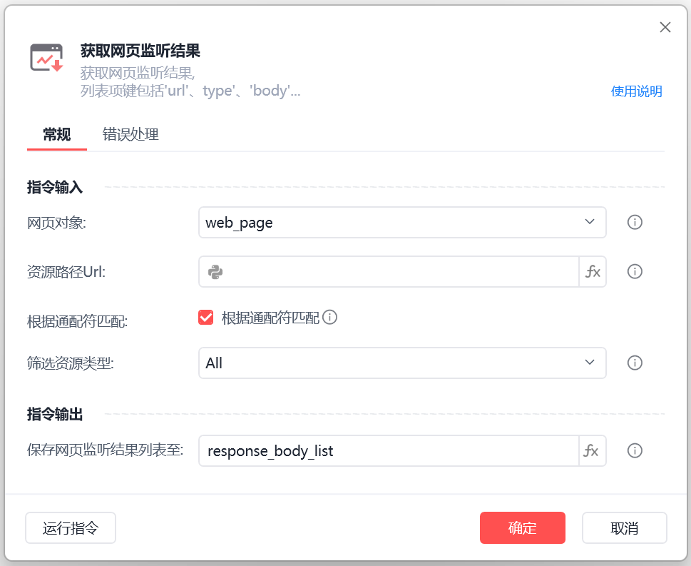
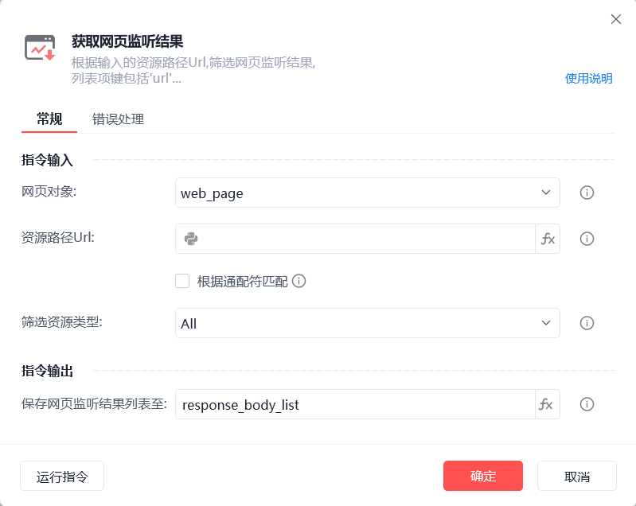
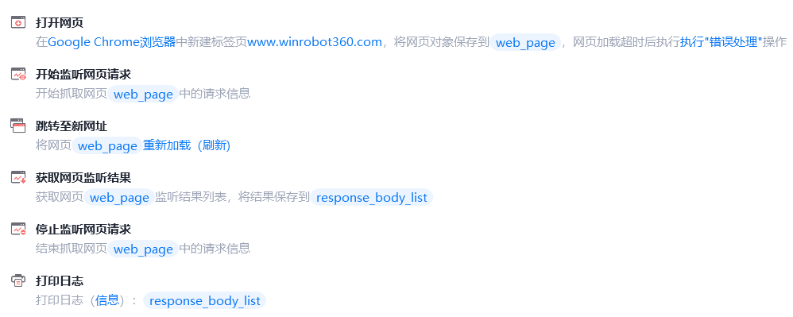

# 获取网页监听结果

获取网页监听结果

🎬 视频课程：【影刀RPA专题教程】HTTP&网页监听

🎬 视频课程：数据获取

为了兼容老版本影刀，获取网页监听结果指令存在两种界面

新版本界面

旧版本界面

以下为新版本介绍
💡

从浏览器获取网页监听结果列表,列表项键包 'type'、'type'、'headers'、'body'、'base64Encoded'、'status'、'requestHeaders'、'requestBody'、 'method',集合中值可以通过比如item['body']的方式获取网页响应。其中'type'类型为已接收的响应的资源类型,与即将被发送的请求的资源类型可能不一致。

配置项说明

网页对象

选择一个之前通过【打开网页】或【获取已打开的网页对象】指令创建的网页对象

应用示例文档

如何使用网页监听指令抓取数据

使用示例

此流程执行逻辑：获取已打开的网页对象 --> 开始监听网页请求 --> 跳转至新网址（重新加载） --> 获取网页监听结果 --> 停止监听网页 --> 打印日志（网页请求结果会以列表的形式呈现）。

以下为老版本介绍
💡

根据输入的资源路径Url（WebSocket 无需指定 Url）,筛选网页指定类型的监听结果, WebSocket 列表项键为'message'，其他列表项键包括'url'、'type'、'status'、'body'、'headers'、'base64Encoded', 集合中的值可以通过比如 item['body'] 的方式获取

配置项说明

网页对象

选择一个之前通过【打开网页】或【获取已打开的网页对象】指令创建的网页对象

资源路径URL

根据输入的资源Url,筛选网页监听结果，可为空

根据通配符匹配

根据通配符筛选Url

筛选资源类型

选择要获取的网页监听结果类型,可筛选JS、图片、文档等类型

保存网页监听结果列表至

保存获取到的网页监听结果列表为变量WebSocket

注：列表项键为'message'，其他列表项键包括'url'、'type'、'status'、'body'、'headers'、'base64Encoded', 集合中的值可以通过比如 item['body'] 的方式获取

使用示例

此流程执行逻辑：打开影刀官网 --> 【开始监听网页请求】 --> 执行【跳转至新网址】重新加载网页 --> 使用【获取网页请求结果】指令监听结果列表并保存结果 --> 【停止监听网页】 --> 执行【打印日志】指令打印监听结果

常见问题

如何使用网页监听指令获取数据

## 参数截图

