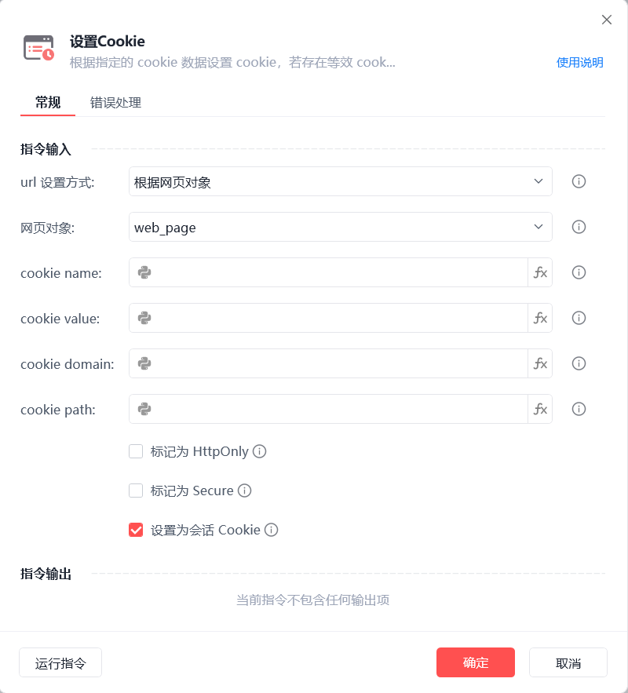
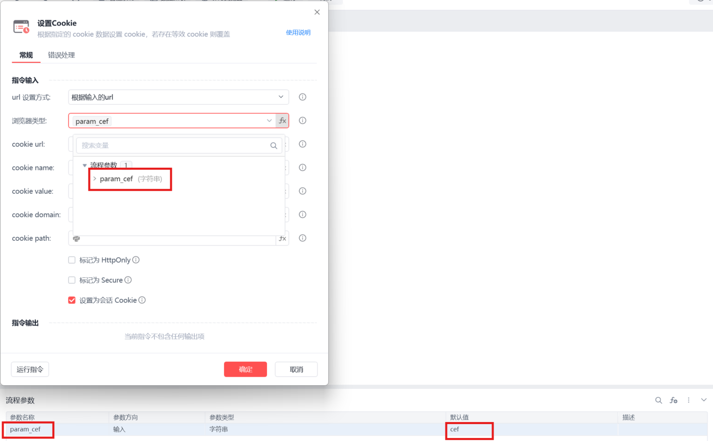
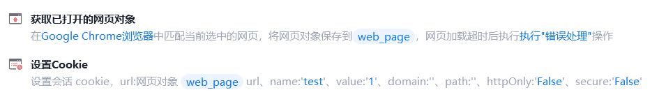

# 设置Cookie

设置Cookie
💡

根据指定的cookie 数据设置 cookie，若存在等效 cookie 则覆盖

url 设置方式

根据网页对象：选择一个之前通过【打开网页】或【获取已打开的网页对象】指令创建的网页对象

根据输入的url：选择浏览器类型，设置与 cookie 相关联的 url，该值影响创建 cookie 的默认 domain 和 path 值

浏览器类型支持fx变量：

浏览器类型

	

变量值

影刀浏览器

	

cef

Google Chrome浏览器

	

chrome

Microsoft Edge浏览器

	

edge

Internet Explorer浏览器

	

ie

360浏览器

	

360se

Firefox

	

firefox

QQ浏览器(自定义)

	

QQBrowser

例如：

cookie name

输入或选择cookie name，可为空

cookie value

输入或选择cookie value，可为空

cookie domain

输入或选择cookie domain，默认为 url 的 domain 部分，若忽略则该 cookie 为 host-only cookie

cookie path

输入或选择cookie path，默认为 url 的 path 部分，可为空

标记为 HttpOnly

设置该 cookie 是否被标记为 HttpOnly，默认为 False

标记为 Secure

设置该 cookie 是否被标记为 Secure，默认为 False

设置为会话 Cookie

默认设置为会话cookie，取消勾选则设置为持久化cookie

使用示例

此流程执行逻辑：【获取已打开的网页对象】 --> 使用【设置Cookie】指令设置Cookie各个值

## 参数截图

