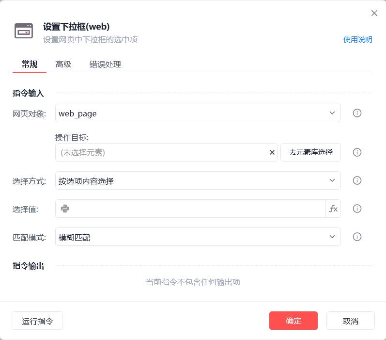
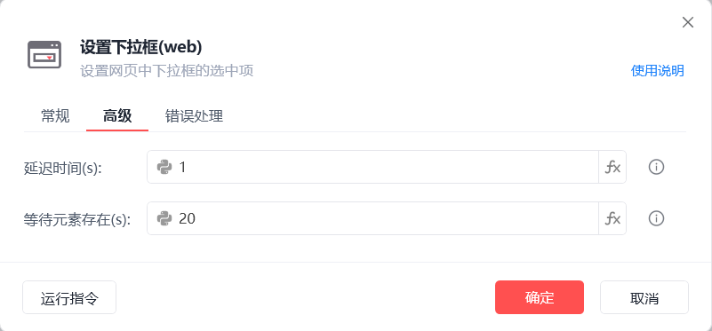

# 设置下拉框(web)

设置下拉框(web)
💡

设置网页中下拉框的选中项

🎬 视频课程：影刀RPA中级课程： 网页自动化-进阶

网页对象

选择一个之前通过【打开网页】或【获取已打开的网页对象】指令创建的网页对象

操作目标

从「元素库」中选择一个已捕获的元素或通过「捕获新元素」来捕获新的网页元素作为操作目标

选择方式

按选项内容选择/按选项位置选择

选择值

设置待选择的选项具体内容或选项的具体位置

匹配方式

模糊匹配/精准匹配/正则匹配

延迟时间(s)

指令执行完成后的等待时间

等待元素存在(s)

等待目标元素存在的超时时间

注：F12打开开发者工具，查看元素标签，只有标签为<select>，【设置下拉框(web)】指令才可生效
如下所示，图①指令可生效，图②指令不生效

使用示例

此流程执行逻辑：打开影刀商城网页 --> 使用【设置下拉框(web)】指令按选项内容选择

## 参数截图

