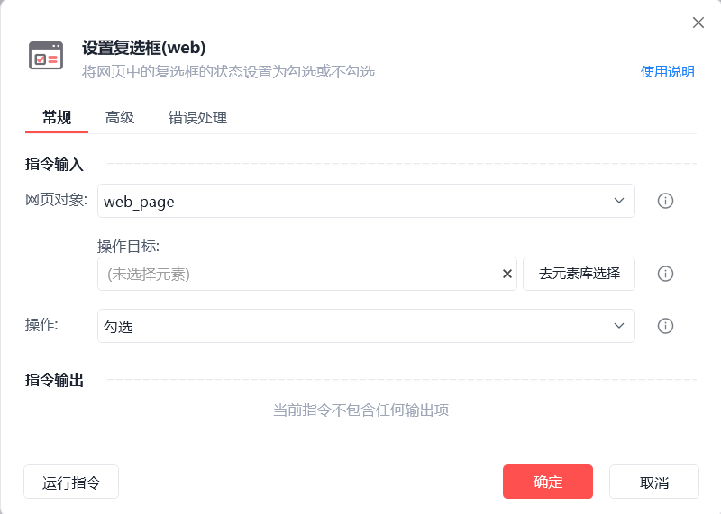
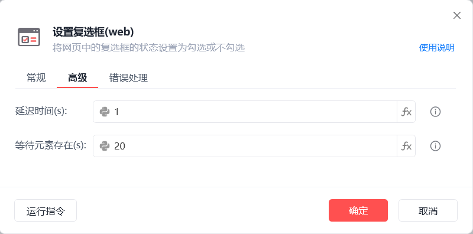
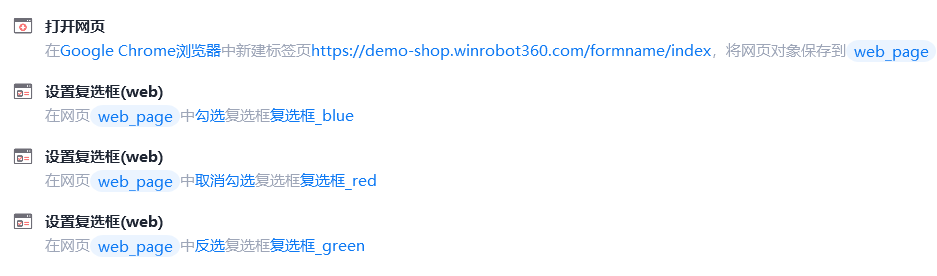
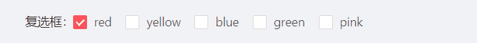

# 设置复选框(web)

设置复选框(web)
💡

将网页中的复选框状态设置为勾选或不勾选

🎬 视频课程：影刀RPA中级课程： 网页自动化-进阶

网页对象

选择一个之前通过【打开网页】或【获取已打开的网页对象】指令创建的网页对象

操作目标

从「元素库」中选择一个已捕获的元素或通过「捕获新元素」来捕获新的网页元素作为操作目标

操作

勾选/取消勾选/反选

延迟时间(s)

指令执行完成后的等待时间

等待元素存在(s)

等待目标元素存在的超时时间

使用示例

此流程执行逻辑：打开影刀商城网页 --> 使用【设置复选框(web)】指令勾选"复选框_blue" --> 使用【设置复选框(web)】指令取消勾选"复选框_red" --> 使用【设置复选框(web)】指令反选"复选框_green"

## 参数截图

