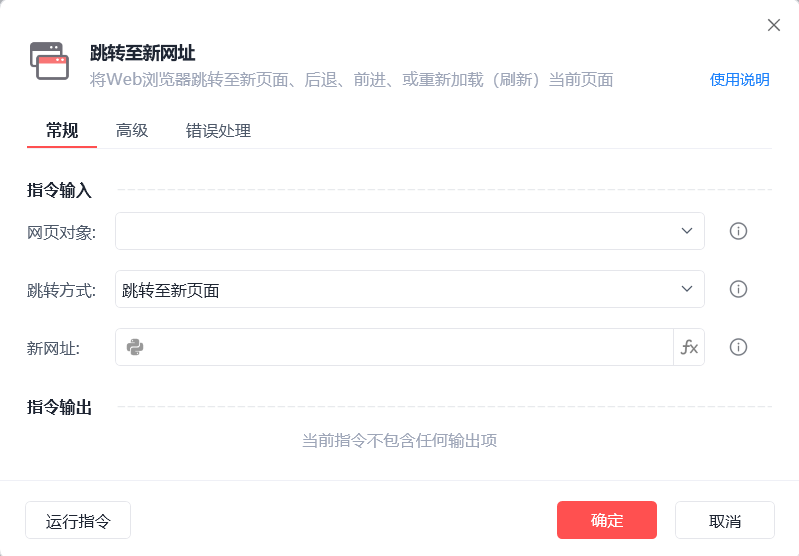

# 跳转至新网址

跳转至新网址
💡

将Web浏览器跳转至新页面、后退、前进或重新加载（刷新）当前页面

🎬 视频课程：影刀RPA中级课程： 网页自动化-进阶

网页对象

选择一个之前通过【打开网页】或【获取已打开的网页对象】指令创建的网页对象

跳转方式

跳转至新页面/后退/前进/重新加载(刷新)

网页加载超时时间(秒)

等待网页加载完成的超时时间，若提示"等待页面加载超时"可适当延长

设置为 0 代表不等待

使用示例

此流程执行逻辑：打开影刀官网--> 使用【跳转至新网址】指令跳转至新页面 --> 使用【跳转至新网址】指令刷新页面

## 参数截图

